# 为 Vuforia 设置项目

为开发 Vuforia AR 或 MR 移动应用程序而设置项目的过程，与使用 Unity 进行移动平台的构建时设置的过程非常相似。Unity 安装程序包含 Vuforia SDK。请按照在 [InstallingUnity](InstallingUnity.html) 手册页上下载和安装 Unity 的说明进行操作。Vuforia 提供了一系列旨在放入场景中的预制件，从而为应用程序提供各种功能。所有这些预制件均可在 Unity Editor 中找到。

应遵循开发常规移动端游戏时所需的相同性能注意事项。有关移动设备优化的信息，请参阅有关[移动端优化](MobileOptimisation.html)的 Unity 文档。

要使用 Unity 设置 Vuforia，请执行以下操作：

* 安装[最新版本的 Unity](https://unity3d.com/get-unity/download)，然后在安装程序的 Unity 组件选择部分中选择 __Vuforia Augmented Reality Support__ 以及 __iOS Build Support__ 或 __Android Build Support__ 包。

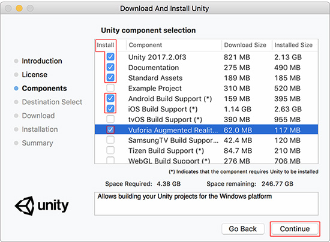

**注意：**大多数 AR 和 MR 应用程序都以移动设备为目标，因此本指南重点关注 Android 和 iOS 的开发。请参阅 [Android](android-GettingStarted.html) 和 [iOS](iphone-GettingStarted.html) 入门文档了解如何为 Android 和 iOS 设备启用构建支持。

* 从 [Vuforia 注册页面](https://developer.vuforia.com/user/register)中创建 Vuforia 开发者帐户。通过此帐户可以访问一些必要的工具，从而在 Unity 中使用 Vuforia 开发 AR 和 MR 应用程序。

* 如果尚未创建 Unity ID，请从 [Unity 注册页面](https://id.unity.com/en/conversations/8c075ba1-a442-41b1-b64d-ad4fb3c56073008f?view=register)中进行此操作。需要 Unity ID 才能从 Unity Asset Store 下载资源包。

* 打开 Unity 并创建新的 3D 项目（确保选中 __Add Asset Package__ 按钮旁边的 __3D__ 选项）。为项目命名，然后单击 __Create project__ 按钮。

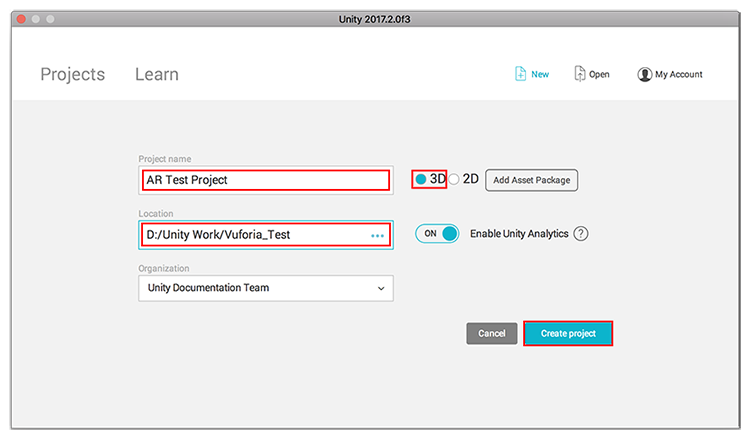

**提示：**从 Unity Asset Store 下载 [Vuforia AR+VR Sample 资源包](https://www.assetstore.unity3d.com/en/#!/content/101547)。此资源包提供了一些用于展示重要功能的有用示例场景。本指南不需要这些场景，但它们对于以后进一步学习很有用。

## 在 Unity 中激活 Vuforia

要在 Unity 项目中激活 Vuforia，请通过 __Edit__ &gt; __Project Settings__ &gt; __Player__ 访问 Player Settings，然后选择要构建到的目标移动设备的相应选项卡。在 __XR Settings__ 下，勾选 __Vuforia Augmented Reality Support__ 复选框。

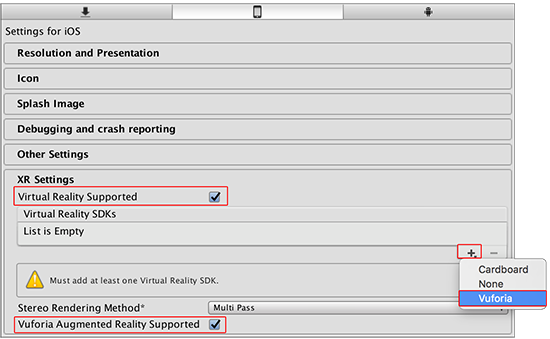

场景中现在包含两个游戏对象：主摄像机和方向光。需要向场景添加新的 AR 摄像机才能启用 AR 功能，并需要从场景中删除当前的__主摄像机__游戏对象。

要删除摄像机游戏对象，请在 __Hierarchy 窗口__中选择该游戏对象，然后按键盘上的 Delete 键，或者右键单击该游戏对象并选择 __Delete__。

有关 XR Settings 窗口中各项设置的更多信息，请参阅本手册的 [Vuforia 平台配置](vuforia_configuration.html)页面。

## 添加 Vuforia AR 摄像机和其他游戏对象

要将 AR 摄像机添加到场景，请选择 __GameObject__ &gt; __Vuforia__ &gt; __AR Camera__。

如果这是第一个添加到场景中的 Vuforia 游戏对象，则 Unity 还会提示导入 Vuforia 资源。选择 __Import__，Unity 便会将所有必要的 Vuforia 文件导入到项目中。

__Project 窗口__会显示 4 个新文件夹，其中一个名为 __Vuforia__。此文件夹中的代码和资源提供了主要的 AR 和 MR 功能。其他文件夹提供示例场景、资源、工具和插件，便于为各种设备开发 AR 和 MR 应用程序。

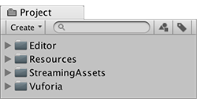

在项目中创建一个新文件夹。为此，请导航到 Project 窗口，单击 __Create__ 按钮，然后选择 __Folder__。将此新文件夹命名为 _Scenes_，并在此文件夹中保存[新场景](CreatingScenes.html)。

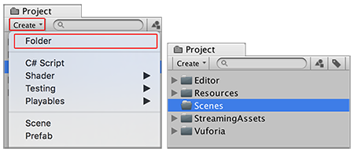

此过程还会在 Scene 层级视图中添加新的 ARCamera 游戏对象。

## 创建 Vuforia 许可证密钥

设置过程的最后一步是从 Vuforia 开发者门户的 [License Manager 部分](https://developer.vuforia.com/Targetmanager/licenseManager/licenseListing)中创建许可证密钥。需要将此信息输入到 Unity 的 Vuforia 配置设置中，以便使用 Unity 构建并测试应用程序。

访问 [Vuforia 开发者门户](https://developer.vuforia.com/user/login)并登录（或创建新帐户）。导航到 __Develop__ 部分的 __License Manager__，然后单击 __Get Development Key__ 按钮以打开 __Add License Key__ 页面。

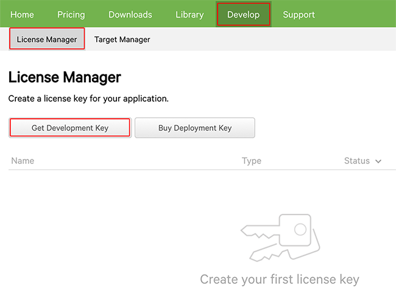

在 __Add License Key__ 页面上，输入应用程序的名称。接受条款和条件，然后单击 __Confirm__ 按钮以生成新的许可证密钥。

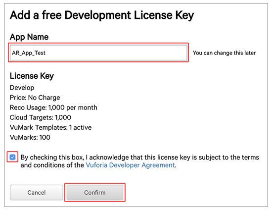

在下一页上，同意 Vuforia 开发者条件（勾选复选框），然后单击 __Confirm__ 按钮。随即将返回 __License Manager__ 页面，并可在列表中看到新创建的许可证及其状态为 __Active__。单击应用程序的名称即可查看许可证详细信息。这样就能检索开发许可证密钥。

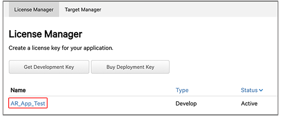

将许可证密钥复制到剪贴板并导航回 Unity 项目。

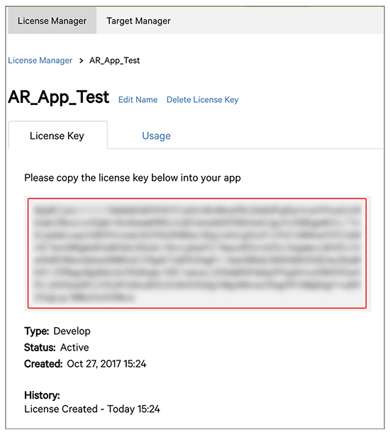

从 __Hierarchy 窗口__中选择 __ARCamera__ 游戏对象，然后在 Inspector 窗口中导航到 __Vuforia Behaviour(Script)__ 组件并单击 __Open Vuforia configuration__ 按钮。

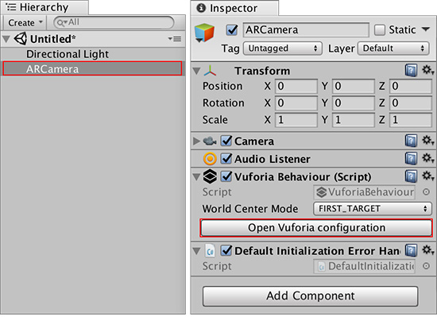

__Inspector 窗口__将显示一组 __Vuforia Configuration__ 选项。将 Vuforia 开发密钥粘贴到 Vuforia 部分下的 __App License Key__ 文本框中，然后单击 __Add License__ 按钮。

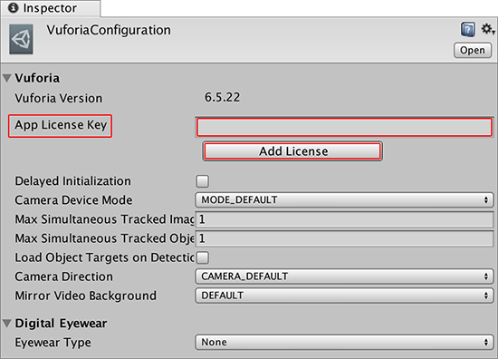

## 测试您的设置

要在 Unity Editor 中测试 Vuforia 应用程序，必须将网络摄像头连接到 PC 或笔记本电脑。为了确保在 Unity 项目中已正确安装 Vuforia，最后一步是按 __Play__ 按钮来测试场景。如果 Vuforia 设置正确，则 Editor Game 视图中会显示来自网络摄像头的视频。

现在已准备好可以设置图像目标并为项目添加 AR 功能。

---
* 2018-03-28 Page published with [editorial review](DocumentationEditorialReview.html)

* 在 2017.3 版中更新了有关 Unity XR API 的 Vuforia 文档
