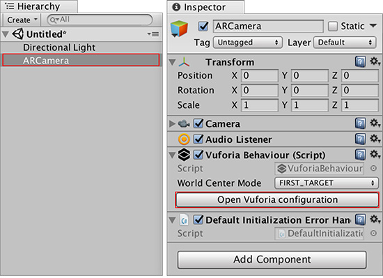
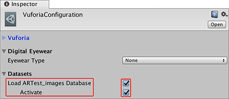

# 在 Unity 中导入和激活目标数据库

在 Unity Editor 中，导航到 __Asset__ &gt; __Import Package__ &gt; __Custom Package__ 并找到硬盘驱动器上的资源包。在 __Import Unity Package__ 窗口中，单击 __Import__ 按钮。

从 __Hierarchy 窗口__中选择 __ARCamera__，然后在 __Inspector 窗口__中导航到 __Vuforia Behaviour (Script)__ 组件并单击 __Open Vuforia configuration__ 按钮。

在 __Vuforia Configuration__ 窗口的 __Datasets__ 下，选中 __Load [DatabaseName] Database__ 复选框和 __Activate__ 复选框。随后将激活图像目标数据库以便用于 Unity。

---
* 2018-03-28 Page published with [editorial review](DocumentationEditorialReview.html)

* 在 2017.3 版中更新了有关 Unity XR API 的 Vuforia 文档
