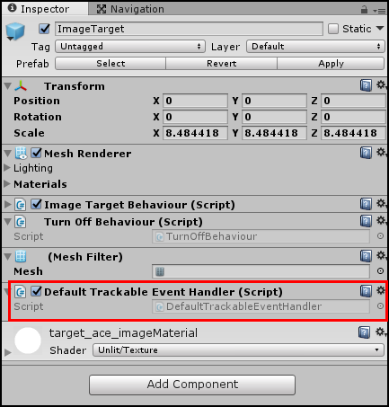
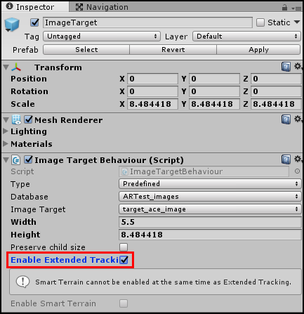

# Vuforia 提示、故障排除和资源

本页面将提供一些有用的提示，旨在帮助您在 Unity 中使用 Vuforia 开发 AR/MR 应用程序。

## 图像目标跟踪

当摄像机在 Editor 内的播放模式下跟踪图像目标时，Unity 会禁用图像目标游戏对象的子游戏对象包含的所有组件。这不包括图像目标游戏对象的子游戏对象上附加的任何脚本组件。即使图像目标不在视图中，所有脚本都会继续运行。因此可能需要您进行条件检查，从而防止脚本的 `Update()` 方法中的代码在您不需要时持续运行。或者，也可以在代码中禁用脚本组件，并在需要时再次启用该组件。

## 在图像目标状态更改事件期间运行代码

在特定图像目标跟踪事件状态（例如目标是否可见）期间运行代码的一种有用脚本是附加到每个图像目标游戏对象的 __Default Trackable Event Handler (Script)__ 组件。



以下是两个最有用的方法：

```
private void OnTrackingFound()
```

当 Vuforia 在__摄像机视图__中找到目标图像游戏对象时，Unity 会从该游戏对象的特定实例的 __Default Trackable Event Handler (Script)__ 组件调用此方法。此方法对于在最开始跟踪对象时运行特定代码非常有用（例如将游戏对象添加到激活状态游戏对象的列表中）。

```
private void OnTrackingLost()
``` 

当 Vuforia 在摄像机视图中丢失对图像目标的跟踪时，Unity 会从该游戏对象的特定实例的 __Default Trackable Event Handler (Script)__ 组件调用此方法。此方法可用于在图像目标从视图中消失时立即运行特定代码（例如在 GameManager 中从用于跟踪应用程序中所有激活状态游戏对象的列表中删除游戏对象）。

## 扩展跟踪

对于仅需要进行初始设置和注册而不需要持续跟踪图像的图像目标，请导航到目标的 __Image Target Behaviour (Script)__ 组件并启用 __Enable Extended Tracking__ 选项。



借助 __Enable Extended Tracking__ 功能，即使图像目标不在摄像机的视野中（在摄像机至少识别一次图像目标之后），图像目标的位置和方向仍然存在；该功能还使用环境功能来提高跟踪性能。有关用于 Vuforia 的扩展跟踪功能的更多详细信息，请参阅关于[扩展跟踪](https://library.vuforia.com/articles/Training/Extended-Tracking)的 Vuforia 文档。

## 发布 AR/MR 应用程序

要将 Vuforia AR 或 MR 应用程序从 Unity 导出到移动平台，请使用与正常发布到 Android 或 iOS 设备时相同的步骤。请参阅有关这些平台的发布操作的文档：

* [发布到 Android](class-PlayerSettingsAndroid.html)
* [发布到 iOS](class-PlayerSettingsiOS.html)

无需特殊设置。

## 实用链接

以下是一些有用的资源和教程，可帮助您了解有关 Vuforia 可用的许多功能的更多信息。

* [Unity Vuforia 论坛](https://forum.unity.com/forums/vuforia.138/)

* [Vuforia 开发者论坛](https://developer.vuforia.com/forum)

* Vuforia 文档：[Vuforia 开发者库](https://library.vuforia.com/)

* Vuforia 文档：[混合现实 AR/VR 体验的最佳实践 (Best practices for mixed reality AR/VR experiences)](https://library.vuforia.com/articles/Best_Practices/Best-practices-for-hybrid-VRAR-experiences.html)

## 故障排除指南

本部分提供的链接可用于访问使用 Vuforia SDK 进行开发时可能遇到的最常见问题的有用故障排除信息。

* [Vuforia 开发者门户：常见问题解答]([https://developer.vuforia.com/forum/faq/faq](https://developer.vuforia.com/forum/faq/faq)

---
* <span class="page-edit">2018-03-28 Page published with [editorial review](DocumentationEditorialReview.html)
</span>

* <span class="page-history">在 2017.3 版中更新了有关 Unity XR API 的 Vuforia 文档</span>
