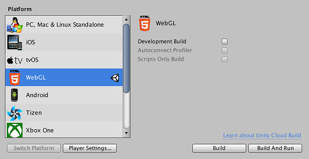
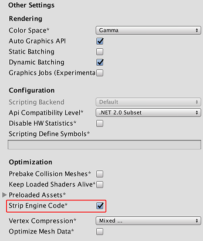
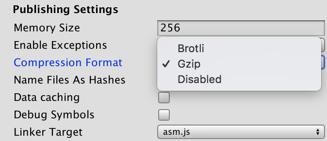

#构建和运行 WebGL 项目

[构建](PublishingBuilds.html) WebGL 项目时，Unity 会创建一个包含以下文件的文件夹：

* _index.html_ 文件，浏览器可通过导航该文件来加载内容。

* 包含构建徽标、加载进度条和其他模板资源的 _TemplateData_ 文件夹（使用默认模板进行构建时）。构建模板文件夹通常用于在加载时自定义构建的外观。有关更多信息，请参阅用户手册的 [WebGL 模板](webgl-templates.html)页面。

* 包含生成的构建输出文件的 _Build_ 文件夹。

_Build_ 文件夹包含以下文件（_MyProject_ 文件名表示项目的名称）。

* _UnityLoader.js_ JavaScript 文件，包含在网页中加载 Unity 内容所需的代码。

* _MyProject.json_ JSON 文件，包含有关构建的所有必要信息。在实例化构建时，此 JSON文件 的 URL 作为 Unity Loader 的参数提供。JSON 文件包含所有其他构建文件的 URL，这些 URL 可以是绝对 URL 或相对于 JSON 文件位置的 URL。JSON 可能包含其他模块参数，例如启动画面样式或内存堆的初始大小。

* _MyProject.asm.framework.unityweb_ 文件，包含 asm.js 运行时和 JavaScript 插件。

* _MyProject.asm.code.unityweb_ 文件，包含播放器的 asm.js 模块。

* _MyProject.asm.memory.unityweb_ 文件，包含二进制映像以用于初始化播放器的堆内存。

* _MyProject.data.unityweb_ 文件，包含资源数据和场景。

_Build_ 文件夹中的 _*.unityweb_ 文件的内容可采用 gzip 或 brotli 压缩格式，也可以不压缩，具体取决于发布设置 (Publishing Settings)。请参阅有关[部署压缩构建](webgl-deploying.html)的文档以了解更多信息

可通过打开 _index.html_ 文件直接在大多数浏览器中查看 WebGL 播放器。但是，出于安全考虑，Chrome 会对从本地文件 URL 打开的脚本设置限制，因此该方法在 Chrome 中无效。要绕开 Chrome 的限制问题，请使用 Unity 的 __Build & Run__ 命令 (__File__ > __Build & Run__)；然后，该文件将临时托管在本地 Web 服务器中，并从本地主机 URL 打开。或者，可使用 `--allow-file-access-from-files` 命令行选项运行 Chrome；该选项允许从本地文件 URL 加载内容。在 PC 上必须符合此条件才能执行构建。

在某些服务器上，需要以显式方式将 _.unityweb_ 文件设置为可访问状态，因为服务器需要将这些文件提供给客户端。

## 构建播放器选项

可通过 __Build Settings__ 对话框访问 WebGL 选项。（菜单：__File__ > __Build Settings...__）。在该对话框中，从 __Platform__ 列表中选择 __WebGL__，然后选择 __Player Settings…__。

 

###Development Build

选中 __Development Build__ 复选框时，Unity 会生成一个支持性能分析器的开发版本和一个用于查看错误的开发控制台。此外，开发版本不会压缩内容（即内容不会[缩小](https://en.wikipedia.org/wiki/Minification_%28programming%29)）；它们以可读的格式维护 JavaScript，保留了函数名称，因此可获取有用的错误堆栈跟踪。但请注意，这意味着开发版本非常庞大，而且大到无法分发。

###Use pre-built Engine

仅当选中 __Development Build__ 复选框时，才会显示此选项。使用 Build Settings 对话框中的 __Use pre-built Engine__ 选项可加快开发期间的版本迭代速度。启用此选项后，Unity 仅重新构建托管的代码，然后与预构建的 Unity 引擎实现动态链接，因此项目重新构建的速度将提高约 30–40%。请注意，此类构建仅适用于开发目的，因为始终会生成未剥离的引擎代码。由于存在动态链接开销，此类构建的性能比正常构建慢。

###Autoconnect Profiler

仅当选中 __Development Build__ 复选框时，才能启用此选项。选中 __Autoconnect Profiler__ 选项可分析 Unity WebGL 内容的性能。对于 WebGL，无法像在其他平台上那样将[性能分析器](ProfilerWindow.html)连接到正在运行的构建，因此必须使用此选项将内容连接到 Editor。这是因为性能分析器连接是使用 WebGL 上的 WebSockets 处理的，但 Web 浏览器仅允许来自内容的传出连接。

##Player Settings

WebGL 在 __PlayerSettings__ Inspector 窗口（菜单：__Edit__ > __Project Settings__ > __Player__）中有一些其他选项。

### Other Settings

 


####Strip Engine Code

打开 __Other Settings__ 访问 __Strip Engine Code__ 选项。默认情况下会选中此选项以启用 WebGL 的代码剥离。选中此选项后，Unity 不会包含未使用的任何类的代码。例如，如果不使用任何物理组件或函数，则会从构建中删除整个物理引擎。有关更多详细信息，请参阅下面的“剥离”部分。

### Publishing Settings

 

####Memory Size

打开 __Publishing Settings__ 访问 __Memory Size__ 字段。在此处可指定内容应为其堆分配内存量（以 MB 为单位）。如果此值太低，则会出现“内存不足”错误消息。这意味着加载的内容和场景无法放入可用内存中。但是，如果此值太高，则内容可能无法在某些浏览器或某些计算机上加载，因为浏览器可能没有足够的可用内存来分配请求的堆大小。此值将写入生成的 .json 文件中一个名为 `TOTAL_MEMORY` 的属性，因此，如果希望在不重新构建项目的情况下试用此设置，可编辑 .json 文件或提供更新的 `TOTAL_MEMORY` 值作为额外的 WebGL 实例化参数。有关更多详细信息，请参阅用户手册的 [WebGL 内存使用](webgl-memory.html)页面。

####Enable Exceptions

打开 __Publishing Settings__ 访问 __Enable Exceptions__。__Enable Exceptions__ 允许指定在运行时如何处理意外的代码行为（通常视为错误）。该设置具有以下选项：

* __None__：如果不需要任何异常支持，请选择此选项。此选项可提供最佳性能和最小构建。使用此选项，抛出的任何异常都会导致内容因该设置中的错误而停止。
* __Explicitly Thrown Exceptions Only__（默认设置）：选择此选项可捕获从脚本中的 `throw` 语句显式指定的异常，并可确保调用 `finally` 代码块。请注意，选择此选项会使脚本中生成的 JavaScript 代码变得更长且更慢；仅当脚本是项目的主要瓶颈时，这才会成为问题。
* __Full Without Stacktrace__：选择此选项可捕获：
	* 从脚本中的 `throw` 语句显式指定的异常（与 _Explicitly Thrown Exceptions Only_ 选项一样）
	* Null 引用
	* 越界数组访问
* __Full With Stacktrace__：此选项与上面的选项类似，但也捕获堆栈跟踪。Unity 通过在代码中嵌入对异常检查来生成这些异常，因此该选项会降低性能并增加浏览器内存使用量。仅用于调试，并始终在 64 位浏览器中进行测试。

选择 __Publishing Settings__ 访问 __Data Caching__。
选择此选项可启用对播放器数据的自动本地缓存。此选项将资源存储位置设置为浏览器的 IndexedDB 数据库中的本地缓存，这样在后续的内容运行中不必再次下载资源。请注意，不同的浏览器在允许 IndexedDB 存储方面有不同的规则；浏览器可能会要求用户提供存储数据的权限，并且构建大小可能超出浏览器定义的大小限制。

##分发大小

以 WebGL 为目标进行发布时，必须保持较低的构建大小，让用户在内容启动之前等待合理的下载时间，这一点很重要。有关减小资源大小的一般提示，请参阅[减小构建文件大小](ReducingFilesize.html)相关文档。

###WebGL 特有的提示和技巧

* 在[纹理导入器 (Texture Importer)](class-TextureImporter.html) 中为所有压缩纹理指定 __Crunch__ 纹理压缩格式。

* 不要部署开发版本；它们不会经过压缩或[缩小](https://en.wikipedia.org/wiki/Minification_%28programming%29)，因此文件大小要大得多。

* 选择 __PlayerSettings__（菜单：__Edit__ > __Project Settings__ > __Player__），打开 __Publishing Settings__，并将 __Enable Exceptions__ 设置为 __None__（如果在构建中不要异常）。

* 选择 __PlayerSettings__（菜单：__Edit__ > __Project Settings__ > __Player__），打开 __Other Settings__，并启用 __Strip Engine Code__，即可确保高效构建。

* 使用第三方托管的 dll 时要小心，因为它们可能包含大量依赖项，所以会显著增加生成的代码大小。

如果要构建发布版本，Unity 将根据在 WebGL __PlayerSettings__ > __Publishing Settings__ 窗口中选择的 __Compression Format__ 来压缩构建输出文件。


 


有关这些选项的更多信息以及如何使用它们发布构建，请参阅有关[部署压缩构建](webgl-deploying.html)的文档。

##AssetBundle

由于所有资源数据都需要在内容启动之前预先下载，因此应考虑将资源从主数据文件中移出到 [AssetBundle](AssetBundlesIntro.html)中。这样，就能为内容创建一个小型加载场景，确保快速加载。然后，当用户继续浏览内容时，将按需动态加载资源。AssetBundle 还有助于进行[资源数据内存](webgl-memory.html)管理：可通过调用 [AssetBundle.Unload](../ScriptReference/AssetBundle.Unload.html) 从内存中卸载掉不再需要的资源的资源数据。

在 WebGL 平台上使用 AssetBundle 时的注意事项：

* 在 AssetBundle 中使用未在主构建中使用的类类型时，Unity 可能会从构建中剥离这些类的代码。尝试从 AssetBundle 加载资源时，这可能会导致失败。请使用 [BuildPlayerOptions.assetBundleManifestPath](../ScriptReference/BuildPlayerOptions-assetBundleManifestPath.html) 修复该问题，或参阅下面有关_[剥离](#Stripping)_的部分以了解其他选项。

* WebGL 不支持线程，但 http 下载内容仅在下载完成后才可用。因此，在下载完成时，Unity WebGL 构建需要在主线程上解压缩 AssetBundle 数据，而这会阻止主线程。为避免这种中断，[LZMA AssetBundle 压缩](AssetBundles-Building.html)不可用于 WebGL 上的 AssetBundle。此情况下使用 LZ4 对 AssetBundle 进行压缩，这种压缩格式可非常高效地按需进行解压缩。如果所需的压缩大小比 LZ4 能够提供的压缩大小更小，可将 Web 服务器配置为对 AssetBundle 使用 gzip 或 Brotli 压缩（基于 LZ4 压缩）。请参阅有关[部署压缩构建](webgl-deploying.html)的文档以详细了解如何执行此操作。

* WebGL 支持通过 [WWW.LoadFromCacheOrDownload](../ScriptReference/WWW.LoadFromCacheOrDownload.html) 对 AssetBundle 进行缓存，可使用来自浏览器的 IndexedDB API 在用户的计算机上实现缓存。请注意，IndexedDB 可能对某些浏览器提供的支持有限，并且浏览器可能会请求用户授权将数据存储在磁盘上。请参阅有关 [WebGL 浏览器兼容性](webgl-browsercompatibility.html)的文档以了解更多信息。

<a name="Stripping"></a> 
## **剥离**

默认情况下，Unity 会从构建中删除所有未使用的代码。可通过 __PlayerSettings__ Inspector 窗口（菜单：__Edit__ > __Project Settings__ > __Player__）来更改此设置：选择 __Other Settings__ 访问 __Strip Engine Code__ 选项。最好在启用剥离的情况下进行构建。

启用代码剥离后，Unity 扫描会项目以查找是否使用了 `UnityObject` 派生的任何类（通过在脚本代码中或在场景中的序列化数据中引用）。然后从构建中删除所有未使用这些类的 Unity 子系统。这样可减少构建代码，从而减小下载和要解析的代码（因此代码运行速度更快，且占用的内存更少）。

## 代码剥离的问题

如果代码剥离时剥离了实际需要的代码，可能会导致项目出现问题。例如，如果在运行时加载的 AssetBundle 所包含的类未包括在主构建中，因此从项目中删除了这些 AssetBundle，这种情况下就可能出问题。发生这种情况时，浏览器的 JavaScript 控制台中会显示错误消息（随后可能会显示更多错误）。例如：

`Could not produce class with ID XXX`

要针对这些错误进行故障排除，请在[类 ID 参考](ClassIDReference.html)中查找该 ID（例如上例中的 `XXX`），查看哪个类正尝试创建实例。在这种情况下，可强制 Unity 在构建中包含该类的代码，方法是向脚本或向场景添加对该类的引用，或者在项目中添加 _link.xml_ 文件。

下面的示例确保了 Collider 类（因此也包括 Physics 模块）在项目中得到保留。可将此 XML 代码添加到名为 _link.xml_ 的文件，然后将该文件放入 _Assets_ 文件夹。

````
<linker>
    <assembly fullname="UnityEngine">
        <type fullname="UnityEngine.Collider" preserve="all"/>
    </assembly>
</linker>

````

如果怀疑剥离导致构建出现问题，还可尝试在测试期间禁用 __Strip Engine Code__ 选项。

通过查看构建中包含哪些模块和类可以优化项目的剥离功能，但 Unity 未提供方便的方法来进行此操作。不过，若要了解包含的类和模块的概况，可在进行构建之后查看生成的文件 _Temp/StagingArea/Data/il2cppOutput/UnityClassRegistration.cpp_。

请注意，__Strip Engine Code__ 选项仅影响 Unity 引擎代码。IL2CPP 始终会从托管的 dll 和脚本中剥离字节代码。需要通过反射（而不是通过代码中的静态引用）来动态引用托管的类型时，这可能会导致问题。如果需要通过反射来访问类型，可能还需要设置 _link.xml_ 文件才能保留这些类型。请参阅有关 [iOS 构建大小优化](iphone-playerSizeOptimization.html)的文档页面以了解关于 _link.xml_ 文件的更多信息。

##移动构建输出文件

要更改 _Build_ 文件夹的位置，请在 index.html 文件中更改 JSON 文件的 URL（_UnityLoader.instantiate_ 的第二个参数）。

要更改 Build 文件夹内的文件的位置，请在 JSON 文件中更改它们的 URL（即 _dataUrl_、_asmCodeUrl_、_asmMemoryUrl_ 和 _asmFrameworkUrl_）。JSON 文件中的所有非绝对 URL 都被视为相对于 JSON 文件位置的 URL。如果要在内容分发网络 (CDN) 上托管文件，可指定位于外部服务器上的 URL，但需要确保托管服务器已启用跨源资源共享 (CORS) 才能保证正常工作。有关 CORS 的更多信息，请参阅手册中的 [WebGL 网络](webgl-networking.html)页面。

##增量构建

IL2CPP 为项目生成的 C++ 代码采用增量编译方式；也就是说，只有自上次构建以来生成的已更改的 C++ 代码才会再次编译。未更改的源代码将重复使用先前构建所生成的相同目标文件。用于增量式 C++ 构建的目标文件存储在 Unity 项目的 _Library/il2cpp_cache_ 目录中。

要对生成的 C++ 代码执行从头开始的全新构建而不使用增量编译，请删除 Unity 项目中的 _Library/il2cpp_cache_ 目录。请注意，如果 Unity Editor 版本与以前的 WebGL 构建版本不同，Unity 会自动从头开始执行全新的构建。

---

* <span class="page-edit">2017-08-25  Page amended with limited [editorial review](DocumentationEditorialReview.html)
</span>

* <span class="page-history">在 Unity 2017.3 中添加了 Full Without Stacktrace</span>
