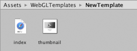

# 使用 WebGL 模板

构建 WebGL 项目时，Unity 会将播放器嵌入到 HTML 页面中，以便能在浏览器中进行播放。默认页面是一个简单的白色页面，其中的灰色画布上有一个加载进度条。或者，可在 Player Settings Inspector（菜单：Edit > Project Settings > Player）中选择最小模板（仅使用必要的样板代码来运行 WebGL 内容）。

 

内置的 HTML 页面适合用于测试和演示最小的播放器，但若是为了生产目的，通常希望播放器托管在最终要部署到的页面中。例如，如果 Unity 内容通过外部调用接口与页面中的其他元素交互，则必须使用提供这些交互元素的页面对其进行测试。Unity 允许使用 __WebGL 模板__提供您自己的页面来托管播放器。

## WebGL 模板的结构

将自定义模板添加到项目中的方法是在 Assets 文件夹中创建名为“WebGLTemplates”的文件夹，并且模板本身将作为此文件夹中的子文件夹。每个模板文件夹都包含一个 *index.html* 文件以及页面所需的任何其他资源，例如图像或样式表。

 

创建模板后，该模板将显示在 Player Settings Inspector 的选项中。（模板的名称将与其文件夹相同）。（可选）文件夹可包含名为 *thumbnail.png* 的文件，其尺寸应为 128x128 像素。该缩略图将显示在 Inspector 中，用于提示完成的页面的外观。

该 html 文件至少需要包含以下元素：

* Unity WebGL 加载程序的脚本标记：
`<script src="%UNITY_WEBGL_LOADER_URL%"></script>`

* 用于实例化游戏的脚本：`<script> var gameInstance = UnityLoader.instantiate("gameContainer", "%UNITY_WEBGL_BUILD_URL%");</script>`

* 一个 `<div>` 标签，其中的 *id* 用在实例化函数中。此 div 的内容将替换为游戏实例。

## __UnityLoader.instantiate(container, url, override)__

*UnityLoader.instantiate* 负责创建内容的新实例。

* __container __可以是 DOM 元素（通常为 `<div>` 元素）或是 DOM 元素的 id。如果提供的是 DOM 元素，则会立即实例化游戏。如果提供的是 DOM 元素的 id，则会在解析整个文档之后实例化游戏（这意味着可提供在 *UnityLoader.instantiate()* 调用时尚未创建的 DOM 元素的 id）。

* __url__ 指定 json 文件的地址，此文件包含有关构建的信息（可使用 *%UNITY_WEBGL_BUILD_URL%* 变量，构建时会自动解析该变量）。

* __override__ 是可选参数，可用于覆盖游戏实例的默认属性。例如，您可以覆盖 *onProgress* 和 *popup* 函数，因为它们是游戏实例的属性。请注意，*Module* 也是游戏实例的属性，因此可在实例化时覆盖 *Module* 的属性。请参考以下示例：

```
UnityLoader.instantiate("MyContainer", “build/MyBuild.json”, {
	onProgress: MyProgressFunction,
	Module: {
		TOTAL_MEMORY: 268435456,
		onRuntimeInitialized: MyInitializationCallbackFunction,
	},
});
```
## 模板标签

在构建过程中，Unity 会在页面文本中查找特殊标签字符串，并将这些字符串替换为 Editor 提供的值。这些字符串包括名称、屏幕尺寸以及有关播放器的其他有用信息。

标签由页面源代码中的百分号 (%) 分隔。例如，如果产品名称在 Player settings 中定义为 __MyPlayer__，则模板的索引文件中的

   `<title>%UNITY_WEB_NAME%</title>`

将在该构建生成的主机页面中使用

   `<title>MyPlayer</title>`

进行替换。完整的标签集如下：

* __UNITY_WEB_NAME__：播放器的名称。

* __UNITY_WEBGL_LOADER_URL__：UnityLoader.js 脚本的 URL，该脚本用于执行构建的实例化。

* __UNITY_WEBGL_BUILD_URL__：JSON 文件的 URL，该文件包含有关构建的所有必要信息。

* __UNITY_WIDTH__ 和 __UNITY_HEIGHT__：播放器的屏幕宽度和高度（以像素为单位）。

* __UNITY_CUSTOM_SOME_TAG__：如果以 `UNITY_CUSTOM_XXX` 的形式向索引文件添加一个标签，则在选择模板后，此标签将显示在 Player Settings 中。例如，如果向源代码添加 `&lt;title&gt;Unity Player | %UNITY_CUSTOM_MYTAG%&lt;/title&gt;`，Player Settings 将如下所示：

 

标签名称旁边的文本框包含在构建期间将替换成的自定义标签的文本。

## 示例

为了说明模板标签的用途，下面提供了 Unity 用于其最小 WebGL 模板的 HTML 源代码。

```
<!DOCTYPE html>
<html lang="en-us">

  <head>
	<meta charset="utf-8">
	<meta http-equiv="Content-Type" content="text/html; charset=utf-8">
	<title>Unity WebGL Player | %UNITY_WEB_NAME%</title>
	<script src="%UNITY_WEBGL_LOADER_URL%"></script>
	<script>
  	var gameInstance = UnityLoader.instantiate("gameContainer", "%UNITY_WEBGL_BUILD_URL%");
	</script>
  </head>
  
  <body>
	<div id="gameContainer" style="width: %UNITY_WIDTH%px; height: %UNITY_HEIGHT%px; margin: auto"></div>
  </body>
  
</html>
```

最小模板和默认模板都可以在 Unity 安装文件夹中找到：Windows 上的 Editor\Data\PlaybackEngines\WebGLSupport\BuildTools\WebGLTemplates 下，或者 Mac 上的 /PlaybackEngines/WebGLSupport/BuildTools/WebGLTemplates 下。

## 添加进度条

Unity WebGL 内容将在加载时自动呈现默认进度条。您可以通过提供自己的进度函数作为附加的实例化参数来覆盖默认的加载进度条。例如：

```
var gameInstance = UnityLoader.instantiate("gameContainer", "%UNITY_WEBGL_BUILD_URL%", {onProgress: UnityProgress});
```

其中，`UnityProgress` 是以下 2 个参数的函数：`gameInstance`（标识进度条所属的游戏实例）和 `progress`（值为 0.0 到 1.0，提供有关当前加载进度的信息）。

例如，默认 WebGL 模板中的进度函数看起来如下所示：

```
var gameInstance = UnityLoader.instantiate("gameContainer", "%UNITY_WEBGL_BUILD_URL%", {onProgress: UnityProgress});
```

例如，默认 WebGL 模板中的进度函数看起来如下所示：

```
function UnityProgress(gameInstance, progress) {
  if (!gameInstance.Module)
    return;
  if (!gameInstance.logo) {
    gameInstance.logo = document.createElement("div");
    gameInstance.logo.className = "logo " + gameInstance.Module.splashScreenStyle;
    gameInstance.container.appendChild(gameInstance.logo);
  }
  if (!gameInstance.progress) {    
    gameInstance.progress = document.createElement("div");
    gameInstance.progress.className = "progress " + gameInstance.Module.splashScreenStyle;
    gameInstance.progress.empty = document.createElement("div");
    gameInstance.progress.empty.className = "empty";
    gameInstance.progress.appendChild(gameInstance.progress.empty);
    gameInstance.progress.full = document.createElement("div");
    gameInstance.progress.full.className = "full";
    gameInstance.progress.appendChild(gameInstance.progress.full);
    gameInstance.container.appendChild(gameInstance.progress);
  }
  gameInstance.progress.full.style.width = (100 * progress) + "%";
  gameInstance.progress.empty.style.width = (100 * (1 - progress)) + "%";
  if (progress == 1)
    gameInstance.logo.style.display = gameInstance.progress.style.display = "none";
}
```

可直接按原样使用，也可将其用作自己模板的参考。由于进度条完全在 JavaScript 中实现，因此可对其进行自定义或替换以显示所需的任何进度指示方式。

----
*  <span class="page-edit">2017-05-24  Page amended with no [editorial review](DocumentationEditorialReview.html)
</span>

* <span class="page-history">5.6 版更新</span>


