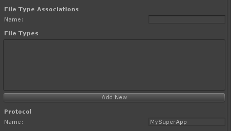

通用 Windows 平台：关联启动
========================

通过 API 可针对文件类型或协议启动用户的默认应用程序。请参阅 [UnityEngine.WSA.Launcher](../ScriptReference/WSA.Launcher.html) 以了解更多信息。

还可将应用程序设置为某个文件类型或协议的默认应用程序。在 Player Settings 中即可设置此信息（更多设置位于 **Package.appxmanifest** > **Declarations** 中）

 

可在[此处](../uploads/Examples/AssocationLaunch.zip)下载一个示例项目。

可在此处阅读更多信息 - [关联启动](http://msdn.microsoft.com/en-us/library/windows/apps/hh452691.aspx)。

---

• 2017-05-16  Page amended with no [editorial review](DocumentationEditorialReview.html)
 

