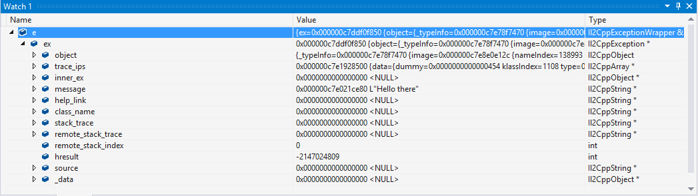

#通用 Windows 平台：IL2CPP 脚本后端上的调试

虽然 IL2CPP 目前没有 C# 调试器，但仍然可以使用 Visual Studio 调试生成的 C++ 代码。

## 生成的 C++ 代码中的类和方法命名

IL2CPP 类如下所示：```<ClassName>_t#number```，其中的 ```<ClassName>``` 是类的普通名称，而 #number 是唯一的类型编号。某些核心类型不存在 #number。例如：

    String_t
    Object_t
    Type_t
    Char_t34
    StringBuilder_t26
    GuidParser_t1539
    
IL2CPP 方法如下所示：```<ClassName>_<MethodName>_m#number```，其中的 ```<ClassName>``` 是声明类型的方法的普通类名，```<MethodName>``` 是普通方法名称，而 ```#number``` 是唯一的方法编号。例如：

    GuidParser_ParseHex_m10003
    ConfigurationSection_DoDeserializeSection_m1275
    String_Format_m4102
    Mathf_Sqrt_m289
    Thing_Start_m1

静态字段结构的命名如下所示：```<ClassName>_t#number_StaticFields```，其中结构名称的第一部分与声明类型相同，例如：

    StringBuilder_t26_StaticFields
    Thing_t24_StaticFields
    
此外，在每个类/方法定义上面都有一条 C++ 注释，指出完整的类/方法名称。例如：

    // System.String
    struct String_t : public Object_t
    {
    	// System.Int32 System.String::length
    	int32_t _length_0;
    	// System.Char System.String::start_char
    	uint16_t _start_char_1;
    };

    // System.Text.StringBuilder
    struct StringBuilder_t26  : public Object_t
    {
    	// System.Int32 System.Text.StringBuilder::_length
    	int32_t length_1;
    	// System.String System.Text.StringBuilder::_str
    	String_t* str_2;
    	// System.String System.Text.StringBuilder::_cached_str
    	String_t* cached_str_3;
    	// System.Int32 System.Text.StringBuilder::_maxCapacity
    	int32_t maxCapacity_4;
    };

    // System.Void MyData::.ctor()
    extern "C" void MyData_ctor_m0 (MyData_t2 * this, const MethodInfo* method)
    {
        ...
    }

    // Thing
    struct Thing_t24 : public MonoBehaviour_t25
    {
    	// MyData Thing::m_Data
    	MyData_t2 * _m_Data_2;
    	// System.Text.StringBuilder Thing::m_Builder
    	StringBuilder_t26 * _m_Builder_3;
    };
    struct Thing_t24_StaticFields
    {
    	// System.Int32 Thing::s_SomeStaticField
    	int32_t _s_SomeStaticField_4;
    };

## 观察变量值

调试最重要的部分之一是观察各种变量的值。Visual Studio 允许将鼠标悬停在变量上以将变量添加到监视窗口中，从而通过相对容易的方式观察变量的值。例如：


观察静态字段有点困难。在 IL2CPP 中，静态字段存储在 Il2CppClass 实例本身上。因此，为了观察静态字段，我们首先需要一个指向该类型 Il2CppClass 结构的指针。这些指针位于使用它们的方法的作用域内，但在观察一次之后，指针将在应用程序运行期间保持在相同的内存地址。Il2CppClass 结构具有“static_fields”字段，该字段便是一个指针，指向包含该特定类型的静态字段的内存块。要查看实际值，必须将此指针强制转换为适当的静态字段结构：每种类型都有自己的字段。例如，我们来观察 ```Thing_t24``` 类的静态字段：

 

## 调查异常

IL2CPP 使用本机 C++ 异常来实现 .NET 异常。当应该抛出某种异常时，IL2CPP 将抛出 Il2CppExceptionWrapper 对象，其定义如下：

    struct Il2CppExceptionWrapper
    {
    	Il2CppException* ex;

    	Il2CppExceptionWrapper (Il2CppException* ex) : ex (ex) {}
    };

可在监视窗口中轻松调查这些异常对象：

 

最后，对异常启用调试器中断，从而能够当场捕获异常的来源，这样可能有助于发现问题。为此，请在 Visual Studio 中按 CTRL+ALT+E，并确保在打开的窗口中选中了 C++ Exceptions 复选框：

 

启用此设置后，只要有异常抛出，Visual Studio 就会自动停止执行：

 

---
<span class="page-edit">• 2017-05-16  Page amended with no [editorial review](DocumentationEditorialReview.html)
</span><br/>
