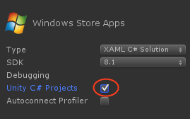
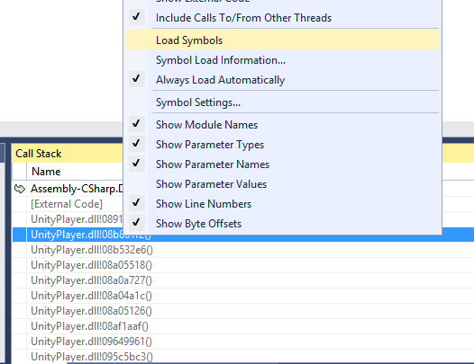

通用 Windows 平台：.NET 脚本后端上的调试
=============================

遇到崩溃或奇怪的行为时，请务必检查位于以下位置的播放器日志 - **&lt;user&gt;\AppData\Local\Packages\<productname&gt;\TempState\UnityPlayer.log**。提交错误时，请同时包含播放器日志，它可以提供宝贵的信息。

目前，只能调试 C# 脚本。

**注意**：通用 Windows 平台与 Microsoft .NET 一起运行，这就是为什么无法使用 MonoDevelop 来调试脚本，而必须使用 Visual Studio 2013。

以下是如何执行此操作的简单步骤：

* 以通用 Windows 平台为目标进行构建时，选中 **Unity C# projects**
* 
* 这将创建与通用 Windows 应用程序兼容的 Assembly-CSharp-* 项目
* **注意**：如果先前未选中 **Unity C# projects**，则构建为空文件夹或删除 *.sln 和 *.csproj，因为 Unity 需要添加对这些文件的引用，但如果它们将存在，Unity 不会覆盖它们
* 打开解决方案，此时应该会看到包含 Assembly-CSharp-* 项目
* 将断点放在感兴趣的位置，然后只需使用调试器启动应用程序
* 

### 异常

运行应用程序时，可以告诉 Visual Studio 在异常期间停止。选择 **Debug** > **Exceptions**：

* 启用 Common Language Runtime Exceptions 和 Managed Debugging Assistants - 适用于托管异常
* 如果在某个未知位置出现异常，请启用所有异常

**注意**：启用所有异常将使 Visual Studio 停止，即使在出现 **WinRT originate error**、**WinRT transform error** 等无害异常时也是如此，请忽略这些异常并继续即可

### 解析 UnityPlayer.dll 的调用栈

有些情况下会在 Unity 引擎本身中发生崩溃，如果能够解析调用栈，可获得有用的信息，并可在需要时在错误报告中提供这些信息。

**注意**：如果 *.pdb 文件可用，则可以解析 Unity 引擎的调用栈（Unity 为调试配置提供 *.pdb 文件）。

假设在 Unity 引擎中遇到崩溃并触发断点（**注意**：如果通过 **Debug** > **Exceptions** 菜单启用所有异常，Visual Studio 可在崩溃时停止），选择 **Debug** > **Windows** > **Call Stack**，随后应该会打开 Call Stack 窗口，如果不能看到 UnityPlayer.dll 中的函数名称，这意味着未加载符号，要修复该问题，右键单击该功能并选择 Load Symbols，UnityPlayer.pdb 文件将位于 [项目路径]>\Players\\[Windows80 或 Windows81]\\[X86 或 ARM 或 X64]\debug。

 

### Microsoft-Windows-TWinUI
这是一个日志，可能提供为何应用程序在没有调试器的情况下未启动的信息，可在以下位置找到该日志：

**Control Panel** > **Administrative Tools** > **Event Viewer** > **Applications And Services Log** > **Microsoft** > **Windows** > **Apps** > **Microsoft-Windows-TWinUI/Operational**

---
• 2017-05-16  Page amended with no [editorial review](DocumentationEditorialReview.html)
 
