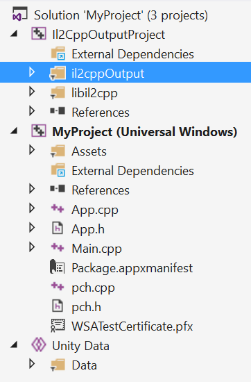

#通用 Windows 平台：使用 IL2CPP 脚本后端生成的项目

使用 IL2CPP 脚本后端从 Unity 构建项目到通用 Windows 平台将创建包含三个项目的 Visual Studio C++ 解决方案：

这些项目有其自身的用途：

1.**Il2CppOutputProject** 包含从托管程序集转换的所生成的 C++ 代码。每次构建时都会覆盖此项目。请参阅图 2。
2.**Unity Data** 项目包含所有 Unity 数据文件：关卡、资源等。每次构建时也会覆盖此项目。
3.主项目（其名称与 Unity 项目名称匹配）。这是要构建到应用程序包中的项目，生成的应用程序包可部署到设备或上传到 Windows 应用商店。Unity 在此项目上构建时不会覆盖项目，所以可对其进行自由修改而不用担心更改会丢失。

使用 .NET 脚本后端时，生成的项目使用 C#，但在使用 IL2CPP 脚本后端时不支持此方案。

###配置

生成的 Visual Studio 项目有三种配置：**Debug**、**Release** 和 **Master**：

* **Debug** 配置会禁用所有优化、保留所有调试信息并且运行速度大幅降低。此配置用于调试游戏。
* **Release** 配置会启用大多数代码优化，但保持性能分析器为启用状态。此配置用于分析游戏性能。
* **Master** 配置会禁用性能分析器，用于游戏提交/最终测试。**Master** 配置的构建时间可能较长，但比 Release 配置快一点。
* 

---
• 2017-05-16  Page amended with no [editorial review](DocumentationEditorialReview.html)
 
