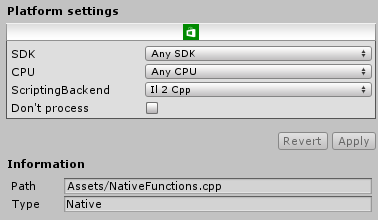

#通用 Windows 平台：IL2CPP 脚本后端上的插件

就目前而言，具有 IL2CPP 脚本后端的通用 Windows 平台的插件模型与其他 Unity 平台（例如 Windows 独立平台）更加相似，而非与具有 .NET 脚本后端的通用 Windows 平台相似。

## 托管插件

默认情况下，IL2CPP 以 .NET 2.0 API 兼容性级别为目标。这意味着，与 .NET 脚本后端不同，它不支持以 .NET 4.5 为目标或使用任何 Windows 运行时 API 的托管插件。使用此兼容性级别时，所有托管插件必须以 .NET 3.5 或同等 API 为目标。如果要解除这些限制，可在播放器设置中切换到 .NET 4.6 API 兼容性级别。

与 .NET 脚本后端相比的另一个不同之处在于，IL2CPP 脚本后端表现出与 Unity Editor 或独立平台播放器完全相同的 .NET API 表面，因此可以使用相同的插件而无需针对通用 Windows 平台的不同 .NET API 来编译单独的版本。

## 原生插件

IL2CPP 脚本后端支持通过 P/Invoke 机制使用原生插件。也就是说，可通过指定原生函数原型再调用该函数来直接从 C# 代码调用原生插件。例如：

    [DllImport("MyPlugin.dll")]
    private static extern int CountLettersInString([MarshalAs(UnmanagedType.LPWSTR)]string str);

    private void Start()
    {
        Debug.Log(CountLettersInString("Hello, native plugin!"));
    }
    
此类函数在 MyPlugin.dll 内的实现如下所示：

    extern "C" __declspec(dllexport)
    int __stdcall CountLettersInString(wchar_t* str)
    {
        int length = 0;
        while (*str++ != nullptr)
            length++;
        return length;
    }

P/Invoke 编组规则与官方 .NET 编组规则一致，但少数不受支持的类型除外：

* AnsiBStr
* BStr
* Currency
* SAFEARRAY
* IDispatch
* IUnknown
* TBStr
* VBByRefStr

在 x86 上，P/Invoke 函数的默认调用约定为 ``__stdcall``。

可通过两种方式编写原生插件：预编译的 DLL 或 C++ 源代码。

### 预编译的原生插件

对预编译的原生插件进行 P/Invoke 调用的工作原理是在运行时加载 DLL，找到函数入口点，然后调用它。必须针对目标 CPU 架构的适当 Windows SDK 编译这些 DLL。添加到 Unity 项目时，还必须在 Plugin Inspector 中配置这些 DLL。

### C++ 源代码原生插件

可以将 C++ (.cpp) 代码文件直接添加到 Unity 项目中作为 Plugin Inspector 中的插件。如果配置为与通用 Windows 平台和 IL2CPP 脚本后端兼容，这些 C++ 文件将与从托管程序集生成的 C++ 代码一起编译：

 

由于函数与生成的 C++ 代码链接在一起，所以没有单独的 DLL 可进行 P/Invoke 调用。因此，可以使用“__Internal”关键字代替 DLL 名称，从而使 C++ 链接器负责解析函数，而不是在运行时加载函数：

    [DllImport("__Internal")]
    private static extern int CountLettersInString([MarshalAs(UnmanagedType.LPWSTR)]string str);

由于调用由链接器解析，因此在托管端的函数声明中发生错误将产生链接器错误，而不是运行时的错误。这也意味着，在运行时不需要进行动态加载，而直接调用函数。这种方式显著降低了 P/Invoke 调用的开销。

### P/Invoke 限制

在通用 Windows 平台上，无法在使用 IL2CPP 脚本后端时指定 dll 名称（如“kernelbase.dll”）来对特定系统库进行 P/Invoke 调用。尝试对项目外部的任何 DLL 进行 P/Invoke 调用将导致运行时出现 DllNotFoundException。

但是，仍然可以通过指定“**Internal”关键字而不是 DLL 名称来对这些系统函数进行 P/Invoke 调用，这会使链接器在构建时解析函数。

## 另请参阅

[Plugin Inspector](PluginInspector.html "Plugin Inspector")

---
• 2017-05-16  Page amended with no [editorial review](DocumentationEditorialReview.html)
 
