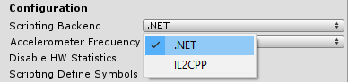

#脚本后端

脚本后端是一个支持 Unity 脚本的框架。截至目前，Unity 根据目标平台支持三种不同的脚本后端：Mono、.NET 和 IL2CPP。但是，通用 Windows 平台仅支持两种：.NET 和 IL2CPP。

可在播放器设置中切换所选的脚本后端：

 

---
• 2017-05-16  Page amended with no [editorial review](DocumentationEditorialReview.html)
 
