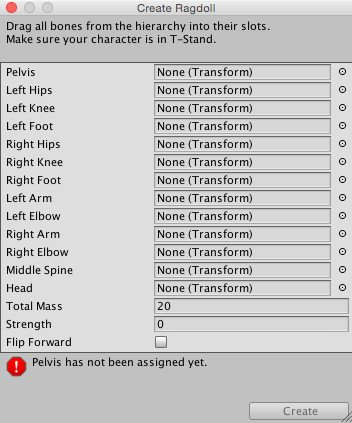

布娃娃向导
==============

Unity 有一个简单的向导可用于快速创建布娃娃。只需在向导中的各种属性上拖动不同的肢体即可。然后，选择 Create，Unity 便会自动生成构成布娃娃的所有__碰撞体__、__刚体__和__关节__。

创建角色
----------------------

布娃娃使用__蒙皮网格__；这是在 3D 建模应用程序中使用骨骼装配的角色网格。因此，必须在 Maya 或 Cinema4D 等 3D 软件包中构建布娃娃角色。

创建角色并进行装配后，将资源正常保存在 __Project 文件夹__中。切换到 Unity 时，您将看到该角色资源文件。选择该文件，然后 Inspector 中将显示 __Import Settings__ 对话框。确保未启用 __Mesh Colliders__。

使用向导
----------------

不太可能将实际的源资源变成一个布娃娃。这将需要修改源资源文件，因此是不可能的。正确的做法是将角色资源的实例变成一个布娃娃，然后保存为__预制件__以供重复使用。

创建角色实例的方法是将角色从 __Project 视图__拖动到 __Hierarchy 视图__。单击层级视图中实例名称左侧的小箭头，展开其__变换层级视图__。现在已准备好开始分配布娃娃部件。

从菜单栏中选择 __GameObject &gt; 3D Object &gt; Ragdoll...__ 以打开布娃娃向导。现在将看到向导本身。

为布娃娃分配部件的过程不言自明。将角色实例的不同变换拖动到向导上的相应属性。如果已自行创建角色资源，此过程应该特别容易。

完成后，单击 __Create__ 按钮。现在进入__播放模式__时，应该会看到角色像布娃娃一样跛行。

最后一步是将设置的布娃娃保存为预制件。从菜单栏中选择__Assets &gt; Create &gt; Prefab__。随后将看到在 Project 视图中显示了一个新预制件 (New Prefab)。将该预制件重命名为“Ragdoll Prefab”。将布娃娃角色实例从层级视图拖动到“Ragdoll Prefab”上。现在有了一个完整设置并可重复使用的布娃娃角色，可在游戏中任意多次使用。

注意
----

对于通过布娃娃向导制作的角色关节，请注意设置：关节的扭转轴与肢体的最大摆动轴对应，关节的 Swing 1 轴与肢体的较小摆动轴对应，而关节的 Swing 2 表示扭转肢体。采用这种命名方案是为了沿用旧版。
