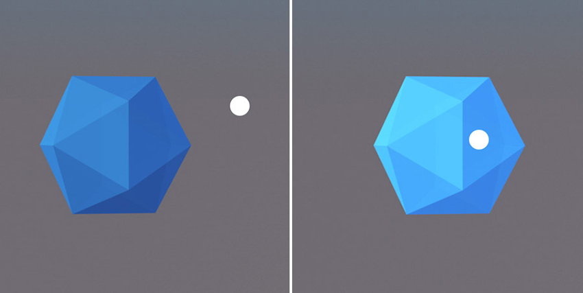
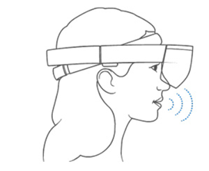
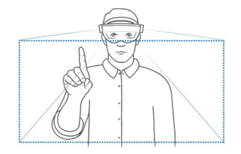
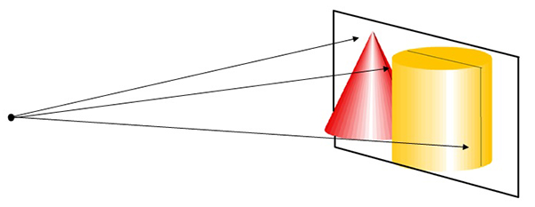
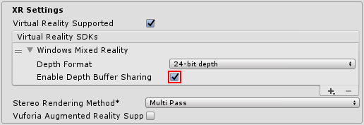

# WMR 输入和交互概念

所有 Windows Mixed Reality 设备都使用特定形式的交互来从用户那里获取输入。其中一些形式的输入特定于具体 Windows Mixed Reality 设备，例如 HoloLens 或沉浸式头盔。

沉浸式头盔使用各种输入，包括空间控制器。HoloLens 仅限于使用 3 种输入形式，除非应用程序除了头盔之外还需要额外的硬件。

所有的输入形式均可与 Windows Mixed Reality 沉浸式头盔结合使用。在 VR 中可使用注视，在使用控制器上的选择按钮时将触发手势，而最终用户将麦克风连接到 PC 时可使用语音。

HoloLens 上的输入与其他平台不同，因为其主要交互方式为：

1.__注视__：通过跟踪用户在世界中的注视位置来控制应用程序。
2.__语音__：简短的口头命令和更长的自由形式听写，可用于发出命令或触发操作。
3.__手势__：手势信号或系统中的控制器输入触发命令。

## 注视（所有设备）

注视是一种跟踪用户注视位置的输入机制：

 

在 HoloLens 上，这种机制具有足够的准确性，可让用户选择世界中的游戏对象。此外，还可用于对场景中的特定游戏对象而非每个游戏对象发出命令。

有关更多信息，请参阅 Microsoft 的[注视标记 (Gaze indicator)](https://dev.windows.com/en-us/holographic/gaze_indicator) 和[注视定位 (Gaze targeting)](https://developer.microsoft.com/en-us/windows/mixed-reality/gaze_targeting) 文档。

## 语音（所有设备）

 

Windows 10 API 在 HoloLens 和沉浸式设备上提供语音输入。Unity 支持三种输入形式：

* __关键字__：用于生成事件的简单命令或短语（在代码中设置）。这种情况下可快速将语音命令添加到应用程序（前提是您不需要对命令进行本地化）。[KeywordRecognizer](../ScriptReference/Windows.Speech.KeywordRecognizer.html) API 提供了这一功能。

* __语法__：具有语义含义的命令表。可通过 XML 语法文件 (.grxml) 来配置语法，并在需要时对该表进行本地化。有关此文件格式的更多信息，请参阅 Microsoft 关于[创建语法文件 (Creating Grammar Files)](https://msdn.microsoft.com/en-us/library/ms873278.aspx) 的文档。[GrammarRecognizer](../ScriptReference/Windows.Speech.GrammarRecognizer.html) API 提供了这一功能。

* __听写__：一种更自由的文本到语音转换系统，可将较长的语音输入转换为文本。为了延长电池续航时间，HoloLens 上的听写识别仅在短时间内有效。该功能要求具备有效的互联网连接。[DictationRecognizer](../ScriptReference/Windows.Speech.DictationRecognizer.html) API 提供了这一功能。

HoloLens 头盔具有内置麦克风，无需额外硬件即可进行语音输入。对于使用沉浸式头盔进行语音输入的应用，用户需要将外部麦克风连接到其 PC。

有关语音输入的更多信息，请参阅 Microsoft 的[语音设计 (Voice design)](https://dev.windows.com/en-us/holographic/Voice_design) 文档。

## 手势（所有设备）

 

手势是由系统解释的手势信号或来自空间控制器的控制器信号。HoloLens 和沉浸式设备都支持手势。沉浸式设备需要空间控制器来启动手势，而 HoloLens 手势需要手部移动。可以使用手势触发应用程序中的特定命令。

Windows Mixed Reality 提供了几种可在应用程序中使用的内置手势，以及用于识别自定义手势的通用 API。内置手势和自定义手势（通过 API 添加）在 Unity 中都可以使用。

有关更多信息，请参阅 Microsoft 的[手势 (gestures)](https://developer.microsoft.com/en-us/windows/mixed-reality/gestures) 文档。

## 焦点（所有设备）

Windows Mixed Reality 使用一个称为晚期重投影 (Late Stage Reprojection, LSR) 的过程来补偿用户头部在帧渲染时与显示器上出现时两个时间点之间的移动。为了补偿这种延迟，LSR 根据最新的头部跟踪数据来修改渲染的图像，然后在显示器上显示图像。

HoloLens 使用稳定平面进行重投影（请参阅有关[基于平面的重投影](https://developer.microsoft.com/en-us/windows/mixed-reality/hologram_stability#stabilization_plane)的 Microsoft 文档）。此平面是空间中的平面，表示用户可能聚焦的区域。此稳定平面具有默认值，但应用程序也可以使用 [SetFocusPoint](../ScriptReference/XR.WSA.HolographicSettings.SetFocusPointForFrame.html) API 来显式设置此平面的位置、法线和速度。对象在与此平面的交点处看起来最稳定。沉浸式头盔也支持这种方法，但对于这些设备，有一种更有效的重投影形式，称为[每像素深度重投影](https://developer.microsoft.com/en-us/windows/mixed-reality/hologram_stability#stabilization_plane)。

使用沉浸式头盔的桌面端应用程序可以启用每像素深度重投影，从而提供更高的质量，而无需应用程序执行显式工作。要启用每像素深度重投影，请打开 Windows Mixed Reality 的 Player Settings，选择 __XR Settings &gt; Virtual Reality SDKs__，然后选中 __Enable Depth Buffer Sharing__。

启用 __Enable Depth Buffer Sharing__ 后，请确保应用程序不显式调用 `SetFocusPoint` 方法，否则会将[每像素深度重投影](https://developer.microsoft.com/en-us/windows/mixed-reality/hologram_stability#stabilization_plane)覆盖为[基于平面的重投影](https://developer.microsoft.com/en-us/windows/mixed-reality/hologram_stability#stabilization_plane)。

除非已将设备的操作系统更新为 Windows 10 Redstone 4 (RS4)，否则 HoloLens 上的 __Enable Depth Buffer Sharing__ 没有任何好处。如果设备运行的是 RS4 系统，则会根据深度缓冲区中找到的值范围来自动确定稳定平面。这种情况下仍然会使用稳定平面进行重投影，但应用程序不需要显式调用 `SetFocusPoint`。

有关 HoloLens 如何实现稳定全息图的更多信息，请参阅 Microsoft 关于[全息图稳定性 (hologram stability)](https://dev.windows.com/en-us/holographic/Hologram_stability.html#Stabilization_Plane) 的文档。

## 锚点（仅限 HoloLens）

锚点组件是虚拟世界与现实世界交互的一种方式。锚点作为一种特殊组件，会覆盖其所附加到的游戏对象的变换组件的位置和方向。

### 世界锚点 (WorldAnchor)

WorldAnchor 表示设备对物理世界中具体点的理解与包含 WorldAnchor 组件的游戏对象之间的联系。添加 WorldAnchor 组件后的游戏对象将保持锁定在现实世界中的某个位置，但随着设备对锚点位置的理解变得更加精确，可能会在不同帧之间移动 Unity 坐标。

WorldAnchor 的一些常见用途包括：

* 将全息游戏板锁定在桌子上。

* 将视频窗口锁定到墙上。

只要有想要固定到物理位置的游戏对象或游戏对象组，就可以使用 WorldAnchor。

WorldAnchor 会覆盖其父游戏对象的变换组件，因此对变换组件的任何直接操作都将丢失。同样，带 WorldAnchor 组件的游戏对象不应包含带动态物理系统的刚体组件。这些刚体组件可能更耗费资源，而且游戏性能将随着 WorldAnchor 的距离变远而降低。

__注意__：仅使用少量 WorldAnchor 以便最大限度减少性能问题。例如，放置在桌子上的游戏板表面仅需要用于游戏板的单个锚点。在这种情况下，桌子的子游戏对象不需要自己的 WorldAnchor。

有关更多信息和最佳实践，请参阅 Microsoft 的[空间锚点 (spatial anchors)](https://developer.microsoft.com/en-us/windows/mixed-reality/spatial_anchors) 文档。

---
* 2018-03-27 Page published with [editorial review](DocumentationEditorialReview.html)

* 在 2017.3 版中添加了关于 XR API 变更的新内容
