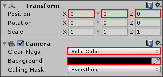
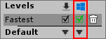
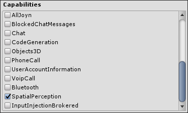
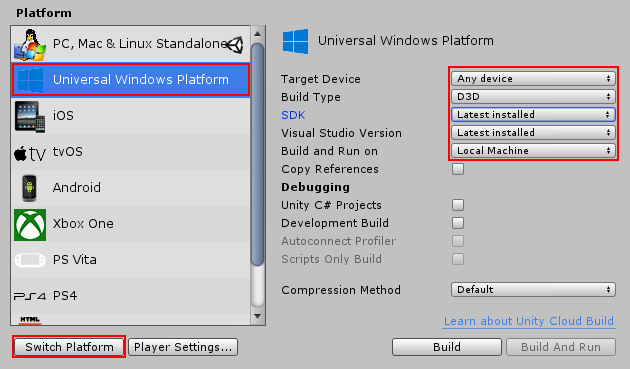
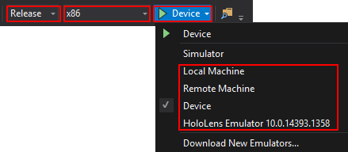

# WMR 快速入门指南

Windows Mixed Reality (WMR) 应用程序是通用 Windows 应用程序，并遵循与其他 [Windows 应用商店应用程序](windowsstore-gettingstarted.html)相同的一般准则。此类应用程序的开发环境为 Visual Studio 2017，不需要安装额外的 SDK（Visual Studio 会安装必要的 SDK）。

## 安装所需的工具

在开发 Windows Mixed Reality 应用程序之前，必须在 PC 和头盔上安装许多工具。这些工具包括：

* [Visual Studio 2017](https://www.visualstudio.com/downloads/) 以及安装的所需工作负载（通用 Windows 平台开发和 Unity 游戏开发）。

* [HoloLens 模拟器和全息模板](https://go.microsoft.com/fwlink/?linkid=852626)（仅在 HoloLens 开发时需要）。

为确保安装所有必需的工具来开发 Windows Mixed Reality 应用程序（在 HoloLens 和沉浸式头盔上），请按照 Microsoft 有关[安装工具 (Installing the Tools)](https://developer.microsoft.com/en-us/windows/mixed-reality/install_the_tools) 的文档中的说明进行操作。

有关 Windows Mixed Reality 开发的详细信息，请参阅 [Microsoft 的 WMR 文档](https://developer.microsoft.com/en-us/windows/mixed-reality/development_overview)。

安装所需工具后，请按照下面的简短指南来设置 Unity 项目并在 Windows Mixed Reality 设备上进行发布。

## 项目设置

Windows Mixed Reality 平台的 Unity 项目与其他平台的 Unity 项目非常相似，但有一些值得注意的例外。要完全支持 Windows Mixed Reality 功能，必须更改摄像机、性能和发布设置，如以下部分所述。

### 摄像机设置

确保要用于跟踪 HMD 位置的摄像机的 __Tag__ 设置为 __MainCamera__。若要检查此设置，请选择要使用的摄像机，然后在 Inspector 窗口中查看 __Tag__ 下拉选单。Unity 会自动将此标签应用于场景中的默认摄像机。

对于 HoloLens，应将 __Main Camera__ 的 __Clear Flags__ 属性设置为 __Solid Color__ 而非默认的 __Skybox__，并将 __Background__ 颜色设置为黑色 (R = 0, G = 0, B = 0, A = 0)。此外，还应该确保摄像机的 __Transform__ 位置设置为 (0, 0, 0)。

### 性能设置

（仅适用于 HoloLens）请使用 __Edit__ &gt; __Project Settings__ &gt; __Quality__ 中的 __Fastest__ 质量设置。此设置可以最大限度提高性能并降低功耗。特别要注意的是，请避免使用柔和阴影和阴影级联，因为这些设置在 HoloLens 上使用时需要太多资源。

要了解有关优化 Windows Mixed Reality 应用程序的更多信息，请参阅 Microsoft 关于 [Unity 性能建议 (Performance recommendations for Unity)](https://dev.windows.com/en-us/holographic/Performance_recommendations_for_Unity) 的文档。

### 发布设置 (Publishing Settings)

要为 Windows Mixed Reality 应用程序启用重要的系统功能，请选择 __Player Settings__ &gt; __Publishing Settings__，然后从 __Capabilities__ 列表中选中要使用的每个选项的复选框。

__注意：__并非 __Capabilities__ 列表中的所有发布设置都是 Windows Mixed Reality 所特有的。有关更多信息，请参阅 [WSA 播放器设置](class-PlayerSettingsWSA.html)。

下表介绍了关于发布 Windows Mixed Reality 应用程序的重要功能设置：

| __功能设置__| __沉浸式头盔支持__ | __HoloLens 支持__ |  __描述__ |
|:---|:---|:---|:---| 
| __InternetClient__| 是 | 是 | 提供对互联网连接的访问，以便与互联网建立传出连接。WMR 需要此功能来进行语音识别。 |
| __InternetClientServer__| 是 | 是 | 提供对互联网连接的访问，包括来自互联网的未经请求的传入连接。应用程序可穿过防火墙来与计算机之间发送信息。WMR 需要此功能来进行语音识别。 注意：如果激活此功能，则无需使用 __InternetClient__。 |
| __MusicLibrary__| 是 | 否 | 提供对音乐库和播放列表的访问，包括添加、更改或删除文件的功能。此设置允许在 WMR 应用程序中使用 __VideoCapture__ 音频录制功能。 |
| __PicturesLibrary__| 是 | 是 | 图片库，包括添加、更改或删除文件的功能。此功能还包括 HomeGroup 计算机上的图片库，以及本地连接的媒体服务器上的图片文件类型。 |
| __VideosLibrary__| 是 | 否 | 视频库，包括添加、更改或删除文件的功能。此功能还包括 HomeGroup 计算机上的视频库，以及本地连接的媒体服务器上的视频文件类型。 |
| __WebCam__| 否 | 是 | 允许在应用程序中使用 __PhotoCapture__ 和 __VideoCapture__ 功能。 |
| __Microphone__| 是 | 是 | 允许在应用程序中使用语音识别功能。 |
| __Bluetooth__| 是 | 是 | 在应用程序中启用蓝牙通信。WMR 需要此功能才能启用 Windows Mixed Reality 空间控制器。 |
| __SpatialPerception __| 否 | 是 | 允许在应用程序中使用[空间映射](SpatialMapping.html)。 |

有关这些功能的更多详细信息，请参阅 [Microsoft 文档](https://docs.microsoft.com/en-us/uwp/schemas/appxpackage/appxmanifestschema/element-capability)。

## 导出 Visual Studio 解决方案

创建完项目并准备好对其进行测试后，请将项目导出到 Visual Studio 解决方案。要部署 WMR 应用程序，必须首先使用 Unity 构建 Visual Studio 解决方案。

选择 __File__ &gt; __Build Settings__，然后从 __Platform__ 列表中选择 __Universal Windows Platform__。现在单击窗口左下角的 __Switch Platform__ 按钮来配置 Editor 以 Windows 为构建目标。

对于标准构建，默认设置适合于 Windows Mixed Reality 沉浸式头盔。

要以 HoloLens 为构建目标，应将 __Target Device__ 设置更改为 __HoloLens__。

下表列出了用于通用 Windows 平台的构建设置 (Build Settings)，并介绍了这些设置的用法。

| **_设置_**||**_描述_** |
|:---|:---|:---| 
| __Target Device__|| 以沉浸式头盔为构建目标时选择 __Any Device__，而以 HoloLens 为构建目标时选择 __HoloLens__。此设置对于优化非常重要。 |
|__Build Type__||选择 D3D (Direct3D) 或 XAML。|
|| __D3D__| 提供比 XAML 更快的结果，因为应用程序中没有 XAML 层。这种情况下将在 3D 独占空间中构建应用程序，并且无法切换到 2D XAML 应用程序，也不能在生成后对此进行修改。 |
|| __XAML__| 在应用程序上添加一个 XAML 代码层，允许用户从 3D 应用程序进行切换并打开 2D 应用程序。生成后可以修改 XAML 代码。采用这种设置最常见的例子是使用 HoloLens 的触摸键盘。 |
| __SDK__||选择应用程序使用的特定 Windows 10 SDK 版本。默认情况下，此设置为 __Latest installed__。 |
| __Visual Studio Version__|| 选择特定的 Visual Studio 版本来为其生成解决方案 (.sln)。默认设置为 __Latest installed__，如果安装的是 Visual Studio 2017，则建议使用此设置。 |
| __Build and Run on__|| 选择在单击 __Build and Run__ 按钮时运行应用程序的设备。默认设置为 __Local Machine__，应该不需要更改此设置。 __注意__：单击 __Build__ 按钮时，Unity 会忽略此选项。  |
| __Copy References__|| 允许将 UnityPlayer.dll、关联的 dll 和数据复制到生成的解决方案文件夹，而不是直接从 Unity 安装文件夹中引用它们。这种情况下需要额外的空间，但生成的解决方案可移植（即使另一台计算机上没有安装 Unity，也可以将该解决方案复制到该计算机上并进行构建）。|
| __Unity C# Projects__|| 允许在生成的解决方案中包含项目中的脚本文件。仅当 __Scripting Backend__ 设置为 __.NET__ 时，此设置才可用。  |
| __Development Build__|| 解锁调试功能，允许开发人员测试和调试构建的项目。这种情况下允许将构建的项目连接到 Unity Profiler，并提供了其他开发功能，例如更详细的调试日志输出。启用此设置还会使 __Scripts Only Build__ 和 __Autoconnect Profiler__ 设置变为可用状态。|
| __Autoconnect Profiler__|| 允许 Unity 的内置性能分析器自动连接到构建版本。仅当启用了 __Development Build__ 时，此设置才可用。 |
| __Scripts Only Build__|| 仅构建项目的脚本。仅当启用了 __Development Build__ 时，此设置才可用。 |

在构建应用程序之前，应配置 Player Settings 以便正确构建 Windows Mixed Reality 应用程序：

1.从 Build Settings 窗口中，单击 __Player Settings__ &gt; __XR Settings__。

2.启用 __Virtual Reality Supported__。

3.单击 __Virtual Reality Devices__ 列表中的 __+__ 按钮，然后选择 __Windows Mixed Reality__。

配置 Build Settings 后，单击 __Build__ 按钮。将项目构建到新文件夹，并记住该位置。

要从 Visual Studio 部署应用程序，请执行以下操作：

1.在 Visual Studio 中，打开在构建项目的文件夹内已生成的解决方案文件 (.sln)。

2.在 Visual Studio 主任务栏（下图从左到右）中，更改解决方案的目标平台，然后选择要运行解决方案的设备。
    
     

3.单击 Run 按钮右侧的下拉箭头（标有绿色箭头），随后将显示可能的设备列表。

从 Visual Studio 测试和运行 Windows Mixed Reality 应用程序时有四个主要选项：

* __Local Machine__
* __Remote Machine__
* __Device__
* __HoloLens Emulator__

以下部分将详细介绍这些选项。并非这些选项全部适用于所有 WMR 设备；有些选项是 HoloLens 或沉浸式头盔所特有的。

### Local Machine（仅限于沉浸式头盔）

__Local Machine__ 允许构建应用程序并将其安装到 Windows 10 PC 上的 Mixed Reality Portal 中。构建后，应用程序会自动在 PC 上运行，可通过沉浸式头盔对其进行测试。

可随时通过“开始”菜单从 Mixed Reality Portal 中再次启动应用程序。

### Remote Machine（仅限 HoloLens）

__Remote Machine__ 会提示输入要部署到的 HoloLens 或其他头盔的 IP 地址。如果在选择 __Remote Machine__ 的情况下单击 __Run__，则会显示一个对话框，要求提供设备的 PIN。

要获取此 PIN，请执行以下操作：

1.开启 HoloLens 并选择 __HoloLens Settings__。

2.选择 __For Developers__ 选项卡，然后使用提供的开关按钮启用 __Developer Mode__。

3.选择 __Pair__ 按钮以获取 __PIN__，然后将其输入 Visual Studio 中的弹出框中。

应用程序将远程安装到 HoloLens 上，并在构建过程完成后自动在设备上运行。

### Device（仅限 HoloLens）

__Device__ 允许构建 Visual Studio 项目并将其部署到通过 USB 线缆连接到 PC 的 HoloLens 设备。

单击 __Run__ 时，Visual Studio 将构建项目，在连接的 HoloLens 上安装应用程序，并在构建过程完成后自动在设备上运行。

### HoloLens Emulator（仅限 HoloLens）

__HoloLens Emulator__ 允许构建 Visual Studio 项目并在已安装的 HoloLens 模拟器上运行应用程序。此模拟器允许在将应用程序部署到 HoloLens 设备之前在 PC 上测试应用程序并模拟手势和其他输入。

### 在生成的解决方案中包含脚本（可选）

勾选 __Unity C# Projects__ 复选框可在生成的解决方案中包含项目中的脚本文件。这样就可以编辑和调试脚本，而无需从 Unity 重新导出。仅当项目设置或内容发生变化时才需要重新导出。仅当 __Scripting Backend__ 设置为 __.NET__ 时，此设置才可用。

可为应用程序使用 __IL2CPP__ 或 __.NET__ 脚本后端。要更改__脚本后端 (Scripting Backend)__，请选择 __Player Settings__ &gt; __Other Settings__，然后在 __Configuration__ 部分中选择相关的后端。

有关 ILCPP 的更多信息，请参阅 Unity 关于 [IL2CCP 的工作原理](IL2CPP-HowItWorks.html)的文档。

有关构建到 Windows Mixed Reality 设备的更多信息，请参阅 Microsoft 关于[导出和构建 Unity Visual Studio 解决方案 (Exporting and building a Unity Visual Studio solution)](https://dev.windows.com/en-us/holographic/Exporting_and_building_a_Unity_Visual_Studio_solution) 的文档。

---
* 2018-03-27 Page published with [editorial review](DocumentationEditorialReview.html)

* 在 2017.3 版中添加了关于 XR API 变更的新内容
