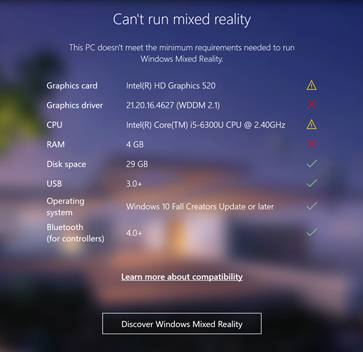

# WMR 硬件和软件要求

本部分将讨论使用 Windows Mixed Reality 设备和应用程序时的硬件兼容性和软件要求。

## 检查兼容性

可使用 Microsoft 的 [Mixed Reality PC Check](https://www.microsoft.com/en-us/store/p/windows-mixed-reality-pc-check/9nzvl19n7cnc?rtc=1#) 应用程序查看 PC 是否已准备好运行 Windows Mixed Reality 应用程序。该检查会测试系统并报告 PC 是否满足要求。

检查完成后，结果窗口将显示以下结果消息之一：

| __兼容性检查结果__| __描述__ |
|:---|:---| 
| __You’re good to go__| PC 符合运行 Windows Mixed Reality 所需的要求  |
| __You’re nearly there__| 某些功能可能有限，但 Windows Mixed Reality 应用程序可以运行 |
| __Can’t Run Mixed Reality__| PC 不符合运行 Windows Mixed Reality 所需的要求 |

结果窗口还会在符合 Microsoft 最低要求的 PC 组件或驱动程序旁边显示绿色勾号。此外也会在不符合最低要求的 PC 组件旁边显示红色“X”。下图展示了此情况：

下表列出了在 Windows 台式机上成功运行 Windows Mixed Reality 应用程序所需的最低和建议的硬件和软件要求。建议的要求可确保以最高质量设置在 Windows 台式机上运行 Windows Mixed Reality 应用程序。

|__组件__|__最低要求__|__建议要求__|
|:---|:---|:---| 
| __操作系统__| Windows 10 Fall Creators Update (RS3) - Home、Pro、Business、Education。 |Windows 10 Fall Creators Update (RS3) - Home、Pro、Business、Education。|
| __CPU 处理器__| Intel Core i5 7200U（第 7 代移动端）双核并启用 Intel® 超线程技术（或更高）。 | Intel Core i5 4590（第 4 代）四核（或更高），AMD Ryzen 5 1400 3.4Ghz（桌面端）四核（或更高）。|
| __磁盘空间__| 至少 10 GB。 | 至少 10 GB。 |
| __RAM__| 8GB DDR3 双通道（或更高）。 | 8GB DDR3 双通道（或更高）。 |
| __蓝牙（用于控制器）__| 蓝牙 4.0 | 蓝牙 4.0 |
| __USB 连接__| USB 3.0 Type-A 或 Type-C | USB 3.0 Type-A 或 Type-C |
| __图形驱动程序__| Windows Display Driver Model (WDDM) 2.2 | Windows Display Driver Model (WDDM) 2.2 |
| __显卡__| 集成 Intel® HD Graphics 620（或更高）DX12 兼容型集成 GPU（[检查您的型号是否更佳](https://en.wikipedia.org/wiki/List-of-Intel-graphics-processing-units#Ninth-generation)） NVIDIA MX150/965M（或更高）DX12 兼容型独立 GPU。 | NVIDIA GTX 960/1050（或更高）DX12 兼容型独立 GPU。AMD RX 460/560（或更高）DX12 兼容型独立 GPU。GPU 必须插入 PCIe 3.0 x4+ Link 插槽中。 |
| __图形显示端口__| HDMI 1.4 或 DisplayPort 1.2 | HDMI 2.0 或 DisplayPort 1.2 |

如需了解其他详细信息以及有关 Microsoft Mixed Reality PC 要求的信息，请参阅 [Microsoft 的 Mixed Reality 硬件兼容性指南](https://developer.microsoft.com/en-us/windows/mixed-reality/windows_mixed_reality_minimum_pc_hardware_compatibility_guidelines)。

---
* 2018-03-27 Page published with [editorial review](DocumentationEditorialReview.html)

* 在 2017.3 版中添加了关于 XR API 变更的新内容
