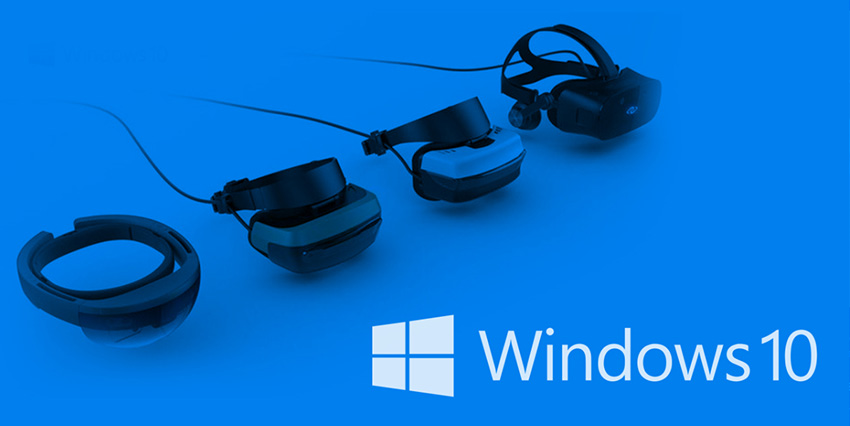
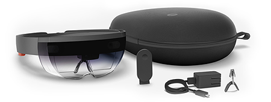
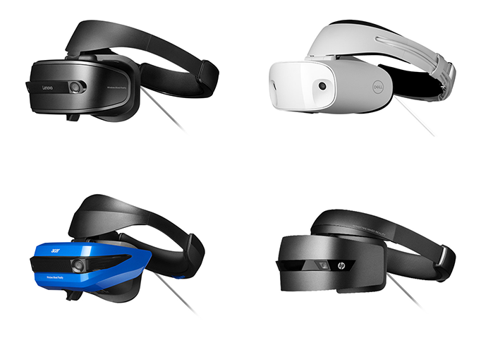
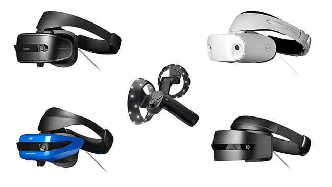

# Windows Mixed Reality

 

Windows Mixed Reality (WMR) 是围绕 Windows 10 API 构建的 Microsoft 平台，允许应用程序在全息和沉浸式显示设备上呈现数字内容。

##全息和沉浸式头盔
Microsoft HoloLens 等全息设备可让您在佩戴头盔后看到周围的物理环境，能够将现实世界与虚拟内容融为一体。

Windows Mixed Reality 沉浸式头盔配备不透明的显示屏，可屏蔽周围物理世界，并在 360 度虚拟环境中提供环绕体验。

###HoloLens
 

HoloLens 是一种用于运行增强现实和混合现实应用程序的设备。HoloLens 和 Windows 沉浸式设备之间存在许多重要差异，开发人员在创建应用程序时应考虑到这些差异。虽然 HoloLens 应用程序使用与其他 Windows Mixed Reality 应用程序相同的工具和 API，但其优势在于允许以独特的方式与现实世界环境进行交互。

#### 什么是全息图？

HoloLens 在设备的视图中渲染 3D 虚拟对象，给人带来这些对象处于周围真实世界环境中的错觉。用户可以使用手势、语音命令和注视等方式与这些对象进行交互。对象还可与物理环境中的真实世界表面进行交互。就像 Unity 中的任何其他游戏对象一样，可将音频、动画和其他组件附加到全息图。

有关全息图的更多信息，请参阅 [Microsoft 开发人员网站](https://developer.microsoft.com/en-us/windows/mixed-reality/hologram)。

###沉浸式头盔

 

Windows Mixed Reality (WMR) 沉浸式头盔配备不透明的显示屏，可屏蔽周围物理世界，并在 360 度虚拟环境中提供环绕体验。

许多虚拟现实设备（例如 HTC Vive 或 Oculus Rift）使用内置于头盔中的传感器和面向这些设备的摄像头来跟踪用户的移动。这种跟踪方式称为由外而内跟踪。大多数 WMR 沉浸式头盔使用由内而外跟踪：由内而外跟踪设备不使用环境中的外部摄像头，而是使用内置于头盔中的外向摄像头进行位置跟踪。Windows Holographic 设备（如 HoloLens）也使用由内而外跟踪。

### 全息和沉浸式设备之间的差异

下表介绍了全息和沉浸式 Windows Mixed Reality 设备的主要功能。

| __功能__| __全息设备__ | __沉浸式设备__ |
|:---|:---|:---| 
| __显示屏__| 透视显示屏，在佩戴头盔后可以看到物理环境 | 不透明显示屏，在佩戴头盔后会屏蔽物理环境 |
| __跟踪规模__| 世界规模 | 固定或房间规模 |
| __跟踪类型__| 由内而外 | 由内而外 |
| __头盔__|   |    |

下表列出了 Hololens 和沉浸式设备之间的重要差异。

| __差异__|__详细信息__|
|:---|:---|
| __全息图并不能取代现实__| 与沉浸式 3D 环境不同，全息图是附加的；设备将全息图绘制在现实世界的基础上。HoloLens 应用程序会增强物理环境并可与之进行交互。|
| __输入模式不同__| HoloLens 的主要输入形式为：  - __注视__（用户观看的位置） - __手势__（由设备解释为命令的手势信号） - __语音__（口头命令）。 这是不同于传统输入方法的重大转变。|
| __HoloLens 设备对功耗很敏感__| HoloLens 是一款移动设备，因此应用程序需要对功耗负责，就像手机应用程序一样。确保禁用功能并优化 CPU 利用率比在其他平台上更重要。  |
| __照片捕捉和视频捕捉__| 只有 HoloLens 才允许用户从设备的摄像头捕捉图片和视频。沉浸式 Windows Mixed Reality 头盔不允许用户访问设备上的摄像头来捕捉照片或视频。通过使用照片和视频捕捉 API，可从连接到 PC 的网络摄像头进行捕捉。 |
| __空间映射__| HoloLens 支持空间映射组件和 API。Windows Mixed Reality 沉浸式头盔则不支持这些。 |
| __跟踪空间__| 沉浸式设备最适合站立（固定）或房间规模体验，而 HoloLens 采用世界规模工作模式。用户不局限于某一个位置，并可远离最初所在的位置。应用程序需要处理动态参考帧和世界锁定内容。 |

有关输入控制映射差异的信息，请参阅 [Windows Mixed Reality 输入](wmr_input_types.html)。

此外，还可在 [Microsoft 的 Mixed Reality 文档](https://developer.microsoft.com/en-us/windows/mixed-reality/mixed_reality)中找到其他详细信息。

---
* 2018-03-27 Page published with [editorial review](DocumentationEditorialReview.html)

* 在 2017.3 版中添加了关于 XR API 变更的新内容
