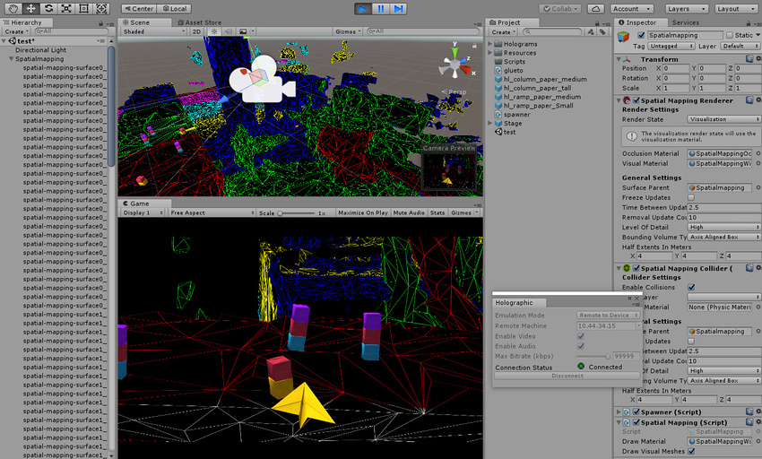
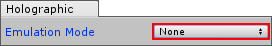
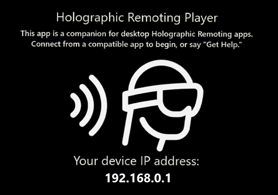
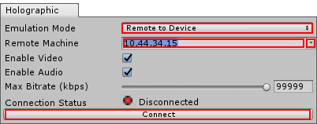
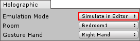

#开发期间的 WMR 测试

Unity 提供了一些工具可用于在开发过程中测试应用程序。就像任何其他 Unity 应用程序一样，这些工具可让您调试自己的应用程序，还能以无线方式将内容推送到设备。这些工具中有一些工具仅适用于特定的 WMR 设备，例如 HoloLens。

## Play in Editor（沉浸式设备）

使用沉浸式 Windows Mixed Reality 设备时，可直接在 Unity Editor 中测试和迭代应用程序。确保 Windows Mixed Reality Portal 已打开且头盔处于激活状态，然后按 Editor 中的 __Play__ 按钮。现在，应用程序将在 Editor 中运行，同时还渲染到头盔。

###已知限制

对 Mixed Reality 设备使用 Play in Editor 时，需要考虑以下几个限制：

* 键盘、鼠标和空间控制器可在 Editor 中工作，但前提是 Windows 和 Unity 能识别它们。

* 非 Windows Mixed Reality 输入设备仅在游戏窗口获得焦点时才有效，否则键盘和鼠标控制可能无法正常工作。

## Holographic Emulation（仅限 HoloLens）

Holographic Emulation（全息仿真）允许直接在 Unity Editor 中对 Microsoft HoloLens 项目进行原型设计、调试和运行，无需在每次希望查看应用更改的效果时都要构建和运行应用程序。这样可以极大缩短在 Unity 中开发 HoloLens 应用程序时的迭代间隔时间。

Holographic Emulation 有三种不同模式：

* __Remote to Device：__通过使用与 Windows Holographic 设备之间的连接，应用程序就像已经部署到该设备一样，而实际上是在主机上的 Unity Editor 中运行。有关更多信息，请参阅以下的 [Emulation Mode：Remote to device](wmr_testing.html#RemoteToDevice) 部分。

* __Simulate in Editor：__应用程序直接在 Unity Editor 中的模拟 HoloLens 设备上运行，无需连接到真实的 Windows Holographic 设备。有关更多信息，请参阅以下的 [Emulation Mode：Simulate in Editor](wmr_testing.html#SimulateInEditor) 部分。

* __None__：此设置允许仍然在 Editor 中运行应用程序（如果有 Windows Holographic 设备）。

Holographic Emulation 仅在运行 Windows 10（装有 __Fall Creators__ 更新）的机器上受支持。__Remote to Device__ 和 __Simulate in Editor__ 均旨在尽可能模仿当前的 HoloLens 运行时，因此不存在超出此范围的更新 API。这意味着最近添加到输入代码的内容在这些情况下不起作用，就像在 HoloLens 上也不起作用一样。例如，旋转、位置精度、角速度以及用于向前、向上和向右姿势的基础向量全都不存在，因此这些 API 将失败。

要启用远程处理或模拟，请打开 Unity Editor 并选择 __Window__ > __Holographic Emulation__。

随即将打开 __Holographic__ 控制窗口，其中包含 __Emulation Mode__ 下拉菜单。必须在开发期间保持此窗口可见，这样在启动应用程序时才能访问其设置。

默认情况下，__Emulation Mode__ 设置为 __None__，这意味着如果拥有沉浸式头盔连接，应用程序将在 Editor 中运行并在 HMD 上播放。有关更多详细信息，请参阅上文的 __Play in Editor__ 部分。

将 __Emulation Mode__ 更改为 __Remote to Device__ 或 __Simulate in Editor__ 可启用 HoloLens 开发的仿真。此设置将为已连接的沉浸式设备覆盖 Play in Editor 支持。

 
### Emulation Mode：Remote to Device

全息远程处理 (Holographic Remoting) 可让应用程序就像已经部署到 HoloLens 设备上一样，而实际是在主机上的 Unity Editor 中运行。即使在远程处理时，来自所连接设备的空间传感器数据和头部跟踪仍然处于激活状态并正常工作。在 Unity Editor Game 视图中可以查看设备上渲染的内容，但不能看到设备的佩戴者看到的真实世界。（请参阅上文中标题为“启用 Holographic Emulation 时的 Unity Editor 运行情况”的图中的示例。）

__注意：__全息远程处理是一种在开发过程中快速迭代更改的方式，但应避免将其用于验证性能。应用程序在主机上而不是在设备本身上运行，因此可能会得到不准确的结果。

要在 Unity Editor 中启用此模式，请将 __Emulation Mode__ 设置为 __Remote to Device__。然后，Holographic 窗口将更改以反映此模式下可用的其他设置。

####连接设备

要远程连接 HoloLens 设备，必须在 HoloLens 设备上安装 [Holographic Remoting Player](https://www.microsoft.com/en-us/store/p/holographic-remoting-player/9nblggh4sv40?activetab=pivot:overviewtab)。

要安装 Holographic Remoting Player 应用程序并配置 Unity Editor，请执行以下操作：

1.从 HoloLens 应用商店安装并运行 Holographic Remoting Player。可从 Hololens 上的 Windows 应用商店应用程序中获取此应用程序。Remoting Player 在启动时进入等待状态，并在 HoloLens 屏幕上显示设备的 IP 地址：
    
    
    
    有关此 Player 的其他信息，包括如何启用连接诊断，请参阅 [Microsoft Windows 开发人员中心](https://developer.microsoft.com/en-us/windows/holographic/holographic_remoting_player)。
2.在 Unity Editor 的 Holographic 窗口的 __Remote Machine__ 字段中输入 HoloLens 设备的 IP 地址。使用该字段右侧的下拉选单按钮可选择最近使用的地址：

    
    
3.单击 __Connect__ 按钮。连接状态应会更改为绿灯并显示已连接消息。

4.单击 Unity Editor 中的 __Play__ 以远程运行设备。

远程处理开始后，即可进行暂停、检查游戏对象以及调试，操作就像在 Editor 中运行任何应用程序一样。HoloLens 设备与主机之间通过网络来回传输视频、音频和设备输入。

####已知限制

对 HoloLens 使用 __Remote to Device__ 仿真时，应考虑以下几个限制：

* 使用 __Remote to Device__ 仿真模式时，Unity 不支持 Speech ([PhraseRecognizer](../ScriptReference/Windows.Speech.PhraseRecognizer.html))。在此模式下，模拟器会拦截运行 Unity Editor 的主机发出的语音。应用程序将使用执行远程处理的 PC 中的麦克风，而不是 Hololens 麦克风。

* 当 __Remote to Device__ 正在运行时，主机上的所有音频都会重定向到设备，包括来自应用程序外部的音频。

 
### Emulation Mode：Simulate in Editor

使用此仿真模式时，应用程序直接在 Unity Editor 中的模拟全息设备上运行，无需连接到真实的 HoloLens 设备。在进行 Windows Holographic 的开发时，如果无法访问 HoloLens 设备，此模式将非常有用。

__注意：__应在 HoloLens 设备上测试应用程序，确保其能够按预期工作。在开发过程中不要完全依赖仿真。

要启用此模式，请将 __Emulation Mode__ 设置为 __Simulate in Editor__，然后单击 __Play__ 按钮。然后，应用程序将在 Unity Editor 内置的模拟器中启动。

在 Holographic Emulation 控制窗口中，使用 __Room__ 下拉菜单选择可用的虚拟房间（与 [XDE HoloLens 模拟器](https://developer.microsoft.com/en-us/windows/mixed-reality/using_the_hololens_emulator)提供的相同）。使用 __Gesture Hand__ 下拉菜单指定由哪个虚拟手执行手势（左手还是右手）。

在 __Simulate in Editor__ 模式中，需要使用游戏控制器（例如 Xbox 360 或 Xbox One 控制器）来控制虚拟人类玩家。如果没有控制器，模拟仍然有效，但无法移动虚拟人类玩家。

下表列出了 __Simulate in Editor__ 模式期间的控制器输入及其用法。

| __控制__| __用法 __  |
|:---|:---| 
| __左摇杆__| 上下方向可使虚拟人类玩家前后移动。左右方向可使人类玩家左右移动。 |
| __右摇杆__| 上下方向可上下旋转虚拟人类玩家的头部（围绕 X 轴旋转 - 俯仰）。左右方向可左右转动虚拟人类玩家（围绕 Y 轴旋转 - 偏航）。 |
| __十字方向键__| 上下移动虚拟人类玩家或左右倾斜玩家的头部（围绕 Z 轴旋转 - 翻滚）。 |
| __左右触发按钮或 A 按钮__| 使用虚拟手执行点击手势。 |
| __Y 按钮__| 重置虚拟人类玩家头部的俯仰（X 旋转）和翻滚（Z 旋转）。 |

要使用游戏控制器，请将 Unity Editor 聚焦在 Game 视图上。如果当前焦点位于另一个 Unity Editor 窗口，请单击 Game 视图窗口以重新聚焦于 Game 视图。

#### 已知限制

对 HoloLens 使用 __Simulate in Editor__ 仿真时，应考虑以下几个限制：

* 大多数游戏控制器都能在 __Simulate in Editor__ 模式下工作，但前提是 Windows 和 Unity 能识别它们。但是，不受支持的控制器可能会导致兼容性问题。

* 可在 __Simulate in Editor__ 模式期间使用 [PhotoCapture](../ScriptReference/XR.WSA.WebCam.PhotoCapture.html)，但由于缺少连接的 HoloLens 设备，必须使用外部连接的摄像头（例如网络摄像头）。这种情况下也会导致无法使用 `TryGetProjectionMatrix` 或 `TryGetCameraToWorldMatrix` 来检索矩阵，因为普通的外部摄像头无法计算自身与现实世界的相对位置。

## 实用资源和故障排除

在解决 Windows Mixed Reality 应用程序的开发问题时，以下外部资源非常有用：

* [Windows Mixed Reality 开发官方文档](https://developer.microsoft.com/en-us/windows/mixed-reality/development)

* [Microsoft Windows Mixed Reality 教程](https://developer.microsoft.com/en-us/windows/mixed-reality/academy)

* [Microsoft Windows Mixed Reality 沉浸式头盔开发教程](https://developer.microsoft.com/en-us/windows/mixed-reality/mixed_reality_213#unity_setup)

* [Microsoft HoloLens 常见问题解答 (FAQ)](https://support.microsoft.com/en-us/help/13456/hololens-and-holograms-faq)

* [Microsoft HoloLens 已知问题](https://developer.microsoft.com/en-us/windows/mixed-reality/hololens_known_issues)

* [Microsoft Windows Mixed Reality 故障排除指南](https://docs.microsoft.com/en-us/windows/mixed-reality/enthusiast-guide/troubleshooting-windows-mixed-reality)

* [Unity 论坛关于 WMR 技术预览版的帖子](https://forum.unity.com/threads/custom-build-2017-2-rc-mrtp-windows-mixed-reality-technical-preview.498253/)

---
* 2018-03-27 Page published with [editorial review](DocumentationEditorialReview.html)

* 在 2017.3 版中添加了关于 XR API 变更的新内容
