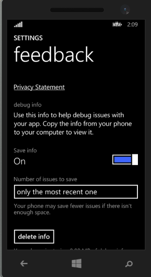

Windows Phone 8.1：调试
==========================

|**警告：这是旧版文档** |
|:---|
|请注意，从 Unity 2017.1 开始，本文档已过时。2017-06-30|

如果应用程序发生崩溃，但未连接调试器，则可以在手机上启用适当设置的情况下获取转储文件。

* 选择 Settings > Feedback
* 将 **Save Info** 设置为 **On**
* 应用程序崩溃时，转储文件应该会保存在 *This PC\<Phone Name>\Phone\Documents\Debug* 中
* **注意：**保存转储文件后，Windows 资源管理器可能仍会显示一个空文件夹，在这种情况下应拔下再插入 USB 线缆以强制 Windows 资源管理器刷新该文件夹。

 

另请参阅 [Windows 应用商店应用程序调试](WindowsDebugging.html)、[日志文件](LogFiles.html)

 
 

----------
*  2017-06-30  Page amended with no [editorial review](DocumentationEditorialReview.html)

